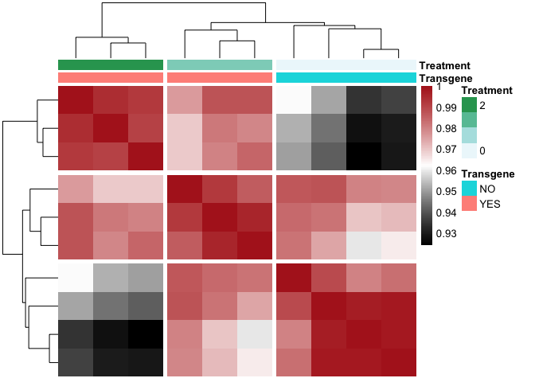

# "ReductomiRs – micro-RNA Signatures in a Reductive Stress Mouse Heart"

Justin M. Quiles, Mark E. Pepin, Sini Sunny, Sandeep B. Shelar, Anil K. Challa, Brian Dalley, John R. Hoidal, Steven M. Pogwizd, Adam R. Wende and 
Namakkal S. Rajasekarana

## Transgenic vs. Non-Transgenic Comparison

### Data Pre-Processing

After alignment of the fastq files to the annotated genome assembly (mm10), the first step in the analysis is to consolidate the raw data from the provided files into data matrix that can be used to generate a normalized count matrix and differential expression dataset.


### Count Normalization

DESeq2 (version 1.18.1) was used to perform the raw count normalization within R (version 3.4.2)


```r
######### RUN DESeq2
dds<-DESeqDataSetFromMatrix(countData=countData, colData = colData, design= ~Transgene)
dds
```

```
## class: DESeqDataSet 
## dim: 36855 10 
## metadata(1): version
## assays(1): counts
## rownames(36855): ENSMUSG00000074183 ENSMUSG00000074181 ...
##   ENSMUSG00000064336 ENSMUSG00000064354
## rowData names(0):
## colnames(10): Counts_control0 Counts_control1 ... Counts_TGH1
##   Counts_TGH2
## colData names(3): Sample_ID Transgene Treatment
```

```r
dds$Transgene<-relevel(dds$Transgene, ref = "NO") # setting the reference to wild-type genotype. only relevant for factors.
#Determine the Dispersion Relationship (determines which distribution to use for the differential analysis) - should take about 2 minutes
dds <- estimateSizeFactors(dds)
dds <- estimateDispersions(dds)
plotDispEsts(dds)
```


There appears to be a linear negative correlation between the mean and dispersion estimates, so the parametric "Wald" model should be an appropriate fit for differential expression analysis. Furthermore, we could get away with the parametric fit-type, but the run-time is not significantly impaired, allowing us to use the 'local' fit-type. NOTE: If it were nonlinear throughout, we would require a 'local' nonparametric fit-type.

### Differential Expression Analysis


```r
##Pre-Filter to reduce the size of this dataset (according to the DESeq2 document reccomendations)
dds <- dds[ rowSums(counts(dds)) > 1, ]
dds
```

```
## class: DESeqDataSet 
## dim: 21222 10 
## metadata(1): version
## assays(2): counts mu
## rownames(21222): ENSMUSG00000074183 ENSMUSG00000074181 ...
##   ENSMUSG00000090756 ENSMUSG00000064336
## rowData names(10): baseMean baseVar ... dispOutlier dispMAP
## colnames(10): Counts_control0 Counts_control1 ... Counts_TGH1
##   Counts_TGH2
## colData names(4): Sample_ID Transgene Treatment sizeFactor
```

```r
################Run DESeq2 differential quantification (Likelihood ratio test (LRT), instead of the wald test - easier for large datasets)
dds<-DESeq(dds, test="Wald", fitType="parametric")
#compile the results tables
res<-DESeq2::results(dds)
resdf<-data.frame(res)
resdf$external_gene_name<-row.names(resdf)
resdf$ensembl_gene_id<-resdf$external_gene_name
```

Once the differential Expression analysis was performed, the following were compiled into a results data matrix: Log2FoldChange, P-value, Bonferroni-Adjusted P-Value (Q-value), and normalized counts for each sample.


```r
####Add Annotation to the results file (this will take some time, about 5 minutes...)
##Add Gene Information
library(biomaRt)
mmusculus <- biomaRt::useEnsembl(biomart = "ENSEMBL_MART_ENSEMBL",
                                     host = "www.ensembl.org",
                                     dataset = "mmusculus_gene_ensembl",
                                     version = 94)
bm <- getBM(attributes=c("ensembl_gene_id", "external_gene_name", "chromosome_name", "start_position", "end_position"), filter="ensembl_gene_id", values= rownames(dds), mart=mmusculus)
results<-dplyr::left_join(resdf, bm, by = "ensembl_gene_id")
####Add normalized count data (for heatmap and sota)
normcount<-counts(dds)
normcount<-as.data.frame(normcount)
normcount$ensembl_gene_id<-row.names(normcount)
results<-dplyr::left_join(results, normcount, by="ensembl_gene_id")
write.csv(results, "../2_Output/mRNA/results_CaNRF2_mRNA_TG.v.NTG.csv")
```

## QQ Plot

Before we examined the gene networks and pathways differentially regulated by NRF2 knockout, the first task was to determine whether transgene induction resulted in global changes. An effective way of determining this is the QQ plot, which compares the P-value distribution produced by the pairwise comparison (transgenic vs. WT mouse) to that of a random normal distribution. Below, it is evident that the two experimental groups produce robustly divergent expression patterns consistent with a true population difference worthy of differential expression analysis.


```r
#Create Q-Q plot
test<-results
test<-test[complete.cases(test),]
pQQ(test$pvalue, lim=c(0,10))
```

<!-- -->

## Heatmap Visualization of Transgenic vs. WT Comparison (P < 0.05)

In order to visualize the distribution of differentially expressed genes, as well as determine the effect of transgenic intensity (TGH vs. TGL), hierarchical clustering and heatmap visualization were performed at the Q < 0.05 statistical level. This analysis reveals that P < 0.05 is sufficient to separate all samples by genotype. In particular, it is apparent that the TGH group display more robust differential expression than TGL when compared to control, in a sort of dose-dependent manner.


```r
library(pheatmap)
results_p05<-filter(results, padj<0.01)
##Index file for annotating samples
rownames(colData)<-colData$Sample_ID
Index<-dplyr::select(colData, Transgene, Treatment)
Index<-as.data.frame(Index)

rownames(results_p05)<-results_p05$external_gene_name.x
counts_p05<-dplyr::select(results_p05, Counts_control0:Counts_TGH2)

paletteLength <- 100
myColor <- colorRampPalette(c("dodgerblue4", "white", "gold2"))(paletteLength)
pheatmap(counts_p05, 
         cluster_cols=T, 
         border_color=NA, 
         cluster_rows=T, 
         scale = 'row', 
         show_colnames = T, 
         show_rownames = F, 
         color = myColor,
         annotation_col = Index)
```

<!-- -->


## Principal Components Analysis

Once we established that the populations under consideration truly display divergene expression patterns, we sought to determine whether unbiased global gene expression patterns recapitulate TGL versus TGH phenotypes within the transgenic group. To accomplish this, an unsupervised Principal Components Analysis (PCA) was initially used with normalized counts.

### PCA Features

Before running the principal components analysis, it was necessary to first determine the number of PC's required to account for 80% of the variance, a machine-learning algorithmm benchmark that provides sufficient confidence in the analysis.


```r
#Plot Features of the PCA
library(readxl)
library(dplyr)
library(plotly)
##Import the data to be used for PCA
results_DEG<-dplyr::select(results, Counts_control0:Counts_TGH2)
results_DEG<-results_DEG[order(-rowSums(results_DEG)),]
#transpose the dataset (required for PCA)
data.pca<-t(results_DEG)
data.pca<-as.data.frame(data.pca)
##Import the data to be used for annotation
rownames(colData)<-colData$Sample_ID
Index<-dplyr::select(colData, Transgene, Treatment)
Index<-as.data.frame(Index)
##merge the file
data.pca_Final<-merge(Index, data.pca, by=0)
rownames(data.pca_Final)<-data.pca_Final$Row.names
pca.comp<-prcomp(data.pca_Final[,(ncol(Index)+2):ncol(data.pca_Final)])

pcaCharts=function(x) {
    x.var <- x$sdev ^ 2
    x.pvar <- x.var/sum(x.var)
    par(mfrow=c(2,2))
    plot(x.pvar,xlab="Principal component", 
         ylab="Proportion of variance", ylim=c(0,1), type='b')
    plot(cumsum(x.pvar),xlab="Principal component", 
         ylab="Cumulative Proportion of variance", 
         ylim=c(0,1), 
         type='b')
    screeplot(x)
    screeplot(x,type="l")
    par(mfrow=c(1,1))
}
pcaCharts(pca.comp)
```

<!-- -->

### 3-Dimensional PCA

From the previous calculations, it is seens that only 2 principal components are necessary (accounting for >80% cumulative variance). Nonetheless, below is a 3-D PCA to ensure that all groups are characterize to higher-degree of stringency.


```r
##Create a 3D-PCA for Inspection
PCs<-merge(pca.comp$x, Index, by=0)
rownames(PCs)<-PCs$Row.names
ax_text<-list(
  family = "times",
  size = 12,
  color = "black")
t <- list(
  family = "times",
  size = 14,
  color = "black")
p <- plot_ly(PCs, x = ~PC1, y = ~PC2, z = ~PC3,
   marker = list(color = ~Treatment, 
                 colorscale = c('#FFE1A1', '#683531'), 
                 showscale = FALSE)) %>%
  add_markers() %>% 
  layout(scene = list(
     xaxis = list(title = 'PC1', zerolinewidth = 4, 
        zerolinecolor="darkgrey", linecolor="darkgrey", 
        linewidth=4, titlefont=t, tickfont=ax_text),
     yaxis = list(title = 'PC2', zerolinewidth = 4, 
        zerolinecolor="darkgrey", linecolor="darkgrey", 
        linewidth=4, titlefont=t, tickfont=ax_text),
    zaxis = list(title = 'PC3', zerolinewidth = 4, 
        zerolinecolor="darkgrey",  linecolor="darkgrey", 
        linewidth=4, titlefont=t, tickfont=ax_text)),
  annotations = list(
           x = 1.13,
           y = 1.03,
           text = 'Transgene',
           xref = '1',
           yref = '0',
           showarrow = FALSE))
p #must comment out for PDF generation via knitr (Pandoc)
```

```{=html}
<div id="htmlwidget-31e876b1dcf983ad8560" style="width:672px;height:480px;" class="plotly html-widget"></div>
<script type="application/json" data-for="htmlwidget-31e876b1dcf983ad8560">{"x":{"visdat":{"24163516c15f":["function () ","plotlyVisDat"]},"cur_data":"24163516c15f","attrs":{"24163516c15f":{"x":{},"y":{},"z":{},"marker":{"color":{},"colorscale":["#FFE1A1","#683531"],"showscale":false},"alpha_stroke":1,"sizes":[10,100],"spans":[1,20],"type":"scatter3d","mode":"markers","inherit":true}},"layout":{"margin":{"b":40,"l":60,"t":25,"r":10},"scene":{"xaxis":{"title":"PC1","zerolinewidth":4,"zerolinecolor":"darkgrey","linecolor":"darkgrey","linewidth":4,"titlefont":{"family":"times","size":14,"color":"black"},"tickfont":{"family":"times","size":12,"color":"black"}},"yaxis":{"title":"PC2","zerolinewidth":4,"zerolinecolor":"darkgrey","linecolor":"darkgrey","linewidth":4,"titlefont":{"family":"times","size":14,"color":"black"},"tickfont":{"family":"times","size":12,"color":"black"}},"zaxis":{"title":"PC3","zerolinewidth":4,"zerolinecolor":"darkgrey","linecolor":"darkgrey","linewidth":4,"titlefont":{"family":"times","size":14,"color":"black"},"tickfont":{"family":"times","size":12,"color":"black"}}},"annotations":[{"x":1.13,"y":1.03,"text":"Transgene","xref":"1","yref":"0","showarrow":false}],"hovermode":"closest","showlegend":false},"source":"A","config":{"showSendToCloud":false},"data":[{"x":[-80685.8062266134,-179159.155038288,-71174.6020569514,-98837.6818655239,107209.915862281,67172.1023848943,126782.66993385,64335.4461343561,57861.2685138884,6495.84235810865],"y":[23486.2585286078,-39290.1380681,29022.5261011266,-26215.9471145263,-6260.94379780434,-117205.227779094,-31131.4968746382,43324.0712417056,62823.1246480386,61447.7731146841],"z":[62003.199332036,8027.62969924111,-102319.112373534,19828.7311181967,4883.69474409674,-25376.6388502875,26310.5409484113,7892.67591266029,-29904.3191763238,28653.5986455029],"marker":{"color":[0,0,0,0,2,2,2,1,1,1],"colorscale":["#FFE1A1","#683531"],"showscale":false,"line":{"color":"rgba(31,119,180,1)"}},"type":"scatter3d","mode":"markers","error_y":{"color":"rgba(31,119,180,1)"},"error_x":{"color":"rgba(31,119,180,1)"},"line":{"color":"rgba(31,119,180,1)"},"frame":null}],"highlight":{"on":"plotly_click","persistent":false,"dynamic":false,"selectize":false,"opacityDim":0.2,"selected":{"opacity":1},"debounce":0},"shinyEvents":["plotly_hover","plotly_click","plotly_selected","plotly_relayout","plotly_brushed","plotly_brushing","plotly_clickannotation","plotly_doubleclick","plotly_deselect","plotly_afterplot","plotly_sunburstclick"],"base_url":"https://plot.ly"},"evals":[],"jsHooks":[]}</script>
```

### 2-D PCA


```r
library(ggfortify)
library(cluster)
autoplot(pca.comp, data = data.pca_Final, colour = "Treatment")
```

<!-- -->

## Correlation of  Differential Gene Expression

```r
# Format for Correlation
library(corrplot)
library(Hmisc)
cor<-data.matrix((counts_p05))
cor.m<-rcorr(cor)
cor.r<-cor(cor)
paletteLength <- 100
myColor <- colorRampPalette(c("dodgerblue4", "white", "brown4"))(paletteLength)
p.mat<-cor.mtest(cor.r)$p
paletteLength <- 100
myColor <- colorRampPalette(c("black", "white","firebrick"))(paletteLength)
pheatmap(cor.r, 
         clustering_method = "single",
         cutree_rows = 3,
         cutree_cols = 3,
         cluster_cols=T,
         border_color=NA, 
         cluster_rows=T, 
         scale = "none", 
         show_colnames = F, 
         show_rownames = F, 
         color = myColor,
         annotation_col = Index)
```

<!-- -->

# miRNA-Sequencing Analysis

## Data Pre-Processing

To determine the effect of miRNA, as well as identify the putative miRNA disregulated in a dose-dependent manner, miRNA-sequencing was performed on the same samples as before.


## Count Normalization

DESeq2 (version 1.18.1) was used to perform the raw count normalization within R (version 3.4.2)


```r
######### RUN DESeq2
dds_mir<-DESeqDataSetFromMatrix(countData=countData_mir, colData = colData_mir, design= ~Transgene)
dds_mir
```

```
## class: DESeqDataSet 
## dim: 623 9 
## metadata(1): version
## assays(1): counts
## rownames(623): mmu-miR-1929-5p mmu-miR-1930-5p ... mmu-miR-215-3p
##   mmu-miR-7236-3p
## rowData names(0):
## colnames(9): Counts_control0 Counts_control1 ... Counts_TGH1
##   Counts_TGH2
## colData names(3): Sample_ID Transgene Treatment
```

```r
dds_mir$Transgene<-relevel(dds_mir$Transgene, ref = "NO") # setting the reference to wild-type genotype. only relevant for factors.
#Determine the Dispersion Relationship (determines which distribution to use for the differential analysis) - should take about 2 minutes
dds_mir <- estimateSizeFactors(dds_mir)
dds_mir <- estimateDispersions(dds_mir)
plotDispEsts(dds_mir)
```

<!-- -->


There appears to be a linear negative correlation between the mean and dispersion estimates, so the parametric "Wald" model should be an appropriate fit for differential expression analysis. Furthermore, we could get away with the parametric fit-type, but the run-time is not significantly impaired, allowing us to use the 'local' fit-type. NOTE: If it were nonlinear throughout, we would require a 'local' nonparametric fit-type.

## Differential Expression Analysis


```r
##Pre-Filter to reduce the size of this dataset (according to the DESeq2 document reccomendations)
dds_mir <- dds_mir[ rowSums(counts(dds_mir)) > 1, ]
dds_mir
```

```
## class: DESeqDataSet 
## dim: 623 9 
## metadata(1): version
## assays(2): counts mu
## rownames(623): mmu-miR-1929-5p mmu-miR-1930-5p ... mmu-miR-215-3p
##   mmu-miR-7236-3p
## rowData names(10): baseMean baseVar ... dispOutlier dispMAP
## colnames(9): Counts_control0 Counts_control1 ... Counts_TGH1
##   Counts_TGH2
## colData names(4): Sample_ID Transgene Treatment sizeFactor
```

```r
################Run DESeq2 differential quantification (Likelihood ratio test (LRT), instead of the wald test - easier for large datasets)
dds_mir<-DESeq(dds_mir, test="Wald", fitType="parametric")
#compile the results tables
res_mir<-DESeq2::results(dds_mir)
resdf_mir<-data.frame(res_mir)
resdf_mir$external_gene_name<-row.names(resdf_mir)
resdf_mir$ensembl_gene_id<-resdf_mir$external_gene_name
```

Once the differential Expression analysis was performed, the following were compiled into a results data matrix: Log2FoldChange, P-value, Bonferroni-Adjusted P-Value (Q-value), and normalized counts for each sample.


```r
####Add normalized count data (for heatmap and sota)
normcount_mir<-counts(dds_mir)
normcount_mir<-as.data.frame(normcount_mir)
normcount_mir$ensembl_gene_id<-row.names(normcount_mir)
results_mir<-dplyr::left_join(resdf_mir, normcount_mir, by="ensembl_gene_id")
rownames(results_mir)<-results_mir$external_gene_name
```

## QQ Plot

Before we examined the gene networks and pathways differentially regulated by NRF2 knockout, the first task was to determine whether transgene induction resulted in global changes. An effective way of determining this is the QQ plot, which compares the P-value distribution produced by the pairwise comparison (transgenic vs. WT mouse) to that of a random normal distribution. Below, it is evident that the two experimental groups produce robustly divergent expression patterns consistent with a true population difference worthy of differential expression analysis.


```r
#Create Q-Q plot
results_mir<-results_mir[complete.cases(results_mir),]
write.csv(results_mir, "../2_Output/miRNA/results_miRNA_TG.v.NTG.csv")
pQQ(results_mir$pvalue, lim=c(0,10))
```

<!-- -->

## Heatmap Visualization of Transgenic vs. WT Comparison (P < 0.05)

In order to visualize the distribution of differentially expressed genes, as well as determine the effect of transgenic intensity (TGH vs. TGL), hierarchical clustering and heatmap visualization were performed at the Q < 0.05 statistical level. This analysis reveals that P < 0.05 is sufficient to separate all samples by genotype. In particular, it is apparent that the TGH group display more robust differential expression than TGL when compared to control, in a sort of dose-dependent manner.


```r
library(pheatmap)
results_p05_mir<-filter(results_mir, padj<.01)
rownames(results_p05_mir)<-results_p05_mir$ensembl_gene_id
##Index file for annotating samples
rownames(colData_mir)<-colData_mir$Sample_ID
Index_mir<-dplyr::select(colData_mir, Transgene, Treatment)
Index_mir<-as.data.frame(Index_mir)
counts_p05_mir<-dplyr::select(results_p05_mir, Counts_control0:Counts_TGH2)

paletteLength <- 100
myColor <- colorRampPalette(c("dodgerblue4", "white", "gold2"))(paletteLength)
pheatmap(counts_p05_mir, 
         cluster_cols=T, 
         border_color=NA, 
         cluster_rows=T, 
         scale = 'row', 
         show_colnames = T, 
         show_rownames = T, 
         color = myColor,
         annotation_col = Index_mir)
```

<!-- -->


## Principal Components Analysis

Once we established that the populations under consideration truly display divergene expression patterns, we sought to determine whether unbiased global gene expression patterns recapitulate TGL versus TGH phenotypes within the transgenic group. To accomplish this, an unsupervised Principal Components Analysis (PCA) was initially used with normalized counts.

### PCA Features

Before running the principal components analysis, it was necessary to first determine the number of PC's required to account for 80% of the variance, a machine-learning algorithmm benchmark that provides sufficient confidence in the analysis.


```r
#Plot Features of the PCA
library(readxl)
library(dplyr)
library(plotly)
##Import the data to be used for PCA
results_dmir<-dplyr::select(results_mir, Counts_control0:Counts_TGH2)
results_dmir<-results_dmir[order(-rowSums(results_dmir)),]
#transpose the dataset (required for PCA)
data.pca_dmir<-t(results_dmir)
data.pca_dmir<-as.data.frame(data.pca_dmir)
##Import the data to be used for annotation
rownames(colData_mir)<-colData_mir$Sample_ID
Index_mir<-dplyr::select(colData_mir, Transgene, Treatment)
Index_mir<-as.data.frame(Index_mir)
##merge the file
data.pca_Final_dmir<-merge(Index_mir, data.pca_dmir, by=0)
rownames(data.pca_Final_dmir)<-data.pca_Final_dmir$Row.names
pca.comp_dmir<-prcomp(data.pca_Final_dmir[,(ncol(Index_mir)+2):ncol(data.pca_Final_dmir)])

pcaCharts=function(x) {
    x.var <- x$sdev ^ 2
    x.pvar <- x.var/sum(x.var)
    par(mfrow=c(2,2))
    plot(x.pvar,xlab="Principal component", 
         ylab="Proportion of variance", ylim=c(0,1), type='b')
    plot(cumsum(x.pvar),xlab="Principal component", 
         ylab="Cumulative Proportion of variance", 
         ylim=c(0,1), 
         type='b')
    screeplot(x)
    screeplot(x,type="l")
    par(mfrow=c(1,1))
}
pcaCharts(pca.comp_dmir)
```

<!-- -->

### 3-Dimensional PCA of miRNA

From the previous calculations, it is seens that again only 2 principal components are necessary (accounting for >80% cumulative variance). Nonetheless, below is a 3-D PCA to ensure that all groups are characterize to higher-degree of stringency.


```r
##Create a 3D-PCA for Inspection
PCs_mir<-merge(pca.comp_dmir$x, Index_mir, by=0)
rownames(PCs_mir)<-PCs_mir$Row.names
ax_text<-list(
  family = "times",
  size = 12,
  color = "black")
t <- list(
  family = "times",
  size = 14,
  color = "black")
p_mir <- plot_ly(PCs_mir, x = ~PC1, y = ~PC2, z = ~PC3,
   marker = list(color = ~Treatment, 
                 colorscale = c('#FFE1A1', '#683531'), 
                 showscale = TRUE)) %>%
  add_markers() %>% 
  layout(scene = list(
     xaxis = list(title = 'PC1', zerolinewidth = 4, 
        zerolinecolor="darkgrey", linecolor="darkgrey", 
        linewidth=4, titlefont=t, tickfont=ax_text),
     yaxis = list(title = 'PC2', zerolinewidth = 4, 
        zerolinecolor="darkgrey", linecolor="darkgrey", 
        linewidth=4, titlefont=t, tickfont=ax_text),
    zaxis = list(title = 'PC3', zerolinewidth = 4, 
        zerolinecolor="darkgrey",  linecolor="darkgrey", 
        linewidth=4, titlefont=t, tickfont=ax_text)),
  annotations = list(
           x = 1.13,
           y = 1.03,
           text = 'Transgene',
           xref = '1',
           yref = '0',
           showarrow = FALSE))
p_mir #must comment out for PDF generation via knitr (Pandoc)
```

```{=html}
<div id="htmlwidget-06f03b8417e95a29f241" style="width:672px;height:480px;" class="plotly html-widget"></div>
<script type="application/json" data-for="htmlwidget-06f03b8417e95a29f241">{"x":{"visdat":{"241669d94da1":["function () ","plotlyVisDat"]},"cur_data":"241669d94da1","attrs":{"241669d94da1":{"x":{},"y":{},"z":{},"marker":{"color":{},"colorscale":["#FFE1A1","#683531"],"showscale":true},"alpha_stroke":1,"sizes":[10,100],"spans":[1,20],"type":"scatter3d","mode":"markers","inherit":true}},"layout":{"margin":{"b":40,"l":60,"t":25,"r":10},"scene":{"xaxis":{"title":"PC1","zerolinewidth":4,"zerolinecolor":"darkgrey","linecolor":"darkgrey","linewidth":4,"titlefont":{"family":"times","size":14,"color":"black"},"tickfont":{"family":"times","size":12,"color":"black"}},"yaxis":{"title":"PC2","zerolinewidth":4,"zerolinecolor":"darkgrey","linecolor":"darkgrey","linewidth":4,"titlefont":{"family":"times","size":14,"color":"black"},"tickfont":{"family":"times","size":12,"color":"black"}},"zaxis":{"title":"PC3","zerolinewidth":4,"zerolinecolor":"darkgrey","linecolor":"darkgrey","linewidth":4,"titlefont":{"family":"times","size":14,"color":"black"},"tickfont":{"family":"times","size":12,"color":"black"}}},"annotations":[{"x":1.13,"y":1.03,"text":"Transgene","xref":"1","yref":"0","showarrow":false}],"hovermode":"closest","showlegend":false},"source":"A","config":{"showSendToCloud":false},"data":[{"x":[-364099.114849777,-27848.3270209532,685304.043075243,-306626.804485747,1042668.88413052,-1238285.56331604,135199.751481609,-111266.785230066,184953.91621521],"y":[-131098.197382159,-181984.00866072,-260451.615673919,140847.573845181,216038.02073061,9313.19811924191,104311.332558053,263336.513228046,-160312.816764333],"z":[220571.897722433,-71422.2706723823,56713.1727055869,-157348.735859851,-142619.069426904,-127041.807137686,190804.648758678,164776.726556951,-134434.562646827],"marker":{"color":[0,0,0,2,2,2,1,1,1],"colorscale":["#FFE1A1","#683531"],"showscale":true,"line":{"color":"rgba(31,119,180,1)"}},"type":"scatter3d","mode":"markers","error_y":{"color":"rgba(31,119,180,1)"},"error_x":{"color":"rgba(31,119,180,1)"},"line":{"color":"rgba(31,119,180,1)"},"frame":null}],"highlight":{"on":"plotly_click","persistent":false,"dynamic":false,"selectize":false,"opacityDim":0.2,"selected":{"opacity":1},"debounce":0},"shinyEvents":["plotly_hover","plotly_click","plotly_selected","plotly_relayout","plotly_brushed","plotly_brushing","plotly_clickannotation","plotly_doubleclick","plotly_deselect","plotly_afterplot","plotly_sunburstclick"],"base_url":"https://plot.ly"},"evals":[],"jsHooks":[]}</script>
```

### 2-D PCA


```r
library(ggfortify)
library(cluster)
autoplot(pca.comp_dmir, data = data.pca_Final_dmir, colour = "Treatment")
```

<!-- -->


# Identifying Putative Nrf2 Binding Sites

In order to identify the response elements likely targeted by Nfe2l2 (Nrf2) we used the position-weighted matrix (PWM) generated by Brochley *et al.*  We scanned the *mus musculus* genome (mm10) for all Nrf2 (Nfe2l2) response elements using the Nfe2l2 PWM via PWMScan (Ambrosini 2018); this process identified 80,756 Nrf2 response elements throughout the mouse genome. These genomic coordinates were then used to determine which differentially-expressed miRNA are likely under the control of Nrf2 based on the presents of Antioxidant Response Elements upstream of the miRNA coding region. 

## Nfe2l2 PWM (based on Brochley *et al.*) in Transfac format

AC MA0150.2 \
XX \
ID Nfe2l2 \
XX
DE MA0150.2 Nfe2l2 ; From JASPAR 2018 \
PO	A	C	G	T \
01	278	23	103	6 \
02	0 2 0 408 \
03	0 0 400 10 \
04	410 0 0 0 \
05	14 287 74 35 \
06	52 11 11 336 \
07	26 315 30 39 \
08	329 2 47 32 \
09	3 3 404 0 \
10	3 398 6 3 \
11	346 13 15 36 \
XX \
// \


## Nfe2l2 response Element: Genomic Annotation

Once the Nfe2l2 response elements were identified, we used Hypergeometric Optimization for Motif Enrichment (HOMER) to annotate these genomic regions according to the most proximal gene. The following command was used: `annotatePeaks pwmscan_mm10_40220_40766.bed mm10 > Nfe2l2_REs.Genome.txt`.

<table class="table" style="margin-left: auto; margin-right: auto;">
<caption>Annotated Response Elements</caption>
 <thead>
  <tr>
   <th style="text-align:center;"> PeakID..cmd.annotatePeaks.pl.pwmscan_mm10_40220_40766.bed.mm10. </th>
   <th style="text-align:center;"> Chr </th>
   <th style="text-align:center;"> Start </th>
   <th style="text-align:center;"> End </th>
   <th style="text-align:center;"> Strand </th>
   <th style="text-align:center;"> Peak.Score </th>
   <th style="text-align:center;"> Focus.Ratio.Region.Size </th>
   <th style="text-align:center;"> Annotation </th>
   <th style="text-align:center;"> Detailed.Annotation </th>
   <th style="text-align:center;"> Distance.to.TSS </th>
   <th style="text-align:center;"> Nearest.PromoterID </th>
   <th style="text-align:center;"> Entrez.ID </th>
   <th style="text-align:center;"> Nearest.Unigene </th>
   <th style="text-align:center;"> Nearest.Refseq </th>
   <th style="text-align:center;"> Nearest.Ensembl </th>
   <th style="text-align:center;"> Gene.Name </th>
   <th style="text-align:center;"> Gene.Alias </th>
   <th style="text-align:center;"> Gene.Description </th>
   <th style="text-align:center;"> Gene.Type </th>
  </tr>
 </thead>
<tbody>
  <tr>
   <td style="text-align:center;"> ATGACTCAGCA-1912 </td>
   <td style="text-align:center;"> chr6 </td>
   <td style="text-align:center;"> 82702040 </td>
   <td style="text-align:center;"> 82702050 </td>
   <td style="text-align:center;"> + </td>
   <td style="text-align:center;"> 1959 </td>
   <td style="text-align:center;">  </td>
   <td style="text-align:center;"> Intergenic </td>
   <td style="text-align:center;"> B2_Mm2|SINE|B2 </td>
   <td style="text-align:center;"> -49180 </td>
   <td style="text-align:center;"> NM_025882 </td>
   <td style="text-align:center;"> 66979 </td>
   <td style="text-align:center;"> Mm.195753 </td>
   <td style="text-align:center;"> NM_025882 </td>
   <td style="text-align:center;"> ENSMUSG00000030042 </td>
   <td style="text-align:center;"> Pole4 </td>
   <td style="text-align:center;"> 2400007P05Rik|5830430F06Rik </td>
   <td style="text-align:center;"> polymerase (DNA-directed), epsilon 4 (p12 subunit) </td>
   <td style="text-align:center;"> protein-coding </td>
  </tr>
  <tr>
   <td style="text-align:center;"> ATGACTCAGCA-4868 </td>
   <td style="text-align:center;"> chr17 </td>
   <td style="text-align:center;"> 64662442 </td>
   <td style="text-align:center;"> 64662452 </td>
   <td style="text-align:center;"> - </td>
   <td style="text-align:center;"> 1959 </td>
   <td style="text-align:center;">  </td>
   <td style="text-align:center;"> intron (NM_008549, intron 6 of 21) </td>
   <td style="text-align:center;"> B2_Mm2|SINE|B2 </td>
   <td style="text-align:center;"> 60798 </td>
   <td style="text-align:center;"> NM_008549 </td>
   <td style="text-align:center;"> 17158 </td>
   <td style="text-align:center;"> Mm.2433 </td>
   <td style="text-align:center;"> NM_008549 </td>
   <td style="text-align:center;"> ENSMUSG00000024085 </td>
   <td style="text-align:center;"> Man2a1 </td>
   <td style="text-align:center;"> Mana-2|Mana2|Map-2 </td>
   <td style="text-align:center;"> mannosidase 2, alpha 1 </td>
   <td style="text-align:center;"> protein-coding </td>
  </tr>
  <tr>
   <td style="text-align:center;"> ATGACTCAGCA-1928 </td>
   <td style="text-align:center;"> chr6 </td>
   <td style="text-align:center;"> 87853595 </td>
   <td style="text-align:center;"> 87853605 </td>
   <td style="text-align:center;"> + </td>
   <td style="text-align:center;"> 1959 </td>
   <td style="text-align:center;">  </td>
   <td style="text-align:center;"> Intergenic </td>
   <td style="text-align:center;"> Intergenic </td>
   <td style="text-align:center;"> -2494 </td>
   <td style="text-align:center;"> NM_001355195 </td>
   <td style="text-align:center;"> 12785 </td>
   <td style="text-align:center;"> Mm.290251 </td>
   <td style="text-align:center;"> NM_013493 </td>
   <td style="text-align:center;"> ENSMUSG00000030057 </td>
   <td style="text-align:center;"> Cnbp </td>
   <td style="text-align:center;"> AA408710|Cnbp1|Znf9 </td>
   <td style="text-align:center;"> cellular nucleic acid binding protein </td>
   <td style="text-align:center;"> protein-coding </td>
  </tr>
  <tr>
   <td style="text-align:center;"> ATGACTCAGCA-405 </td>
   <td style="text-align:center;"> chr1 </td>
   <td style="text-align:center;"> 191471513 </td>
   <td style="text-align:center;"> 191471523 </td>
   <td style="text-align:center;"> - </td>
   <td style="text-align:center;"> 1959 </td>
   <td style="text-align:center;">  </td>
   <td style="text-align:center;"> Intergenic </td>
   <td style="text-align:center;"> RSINE1|SINE|B4 </td>
   <td style="text-align:center;"> -6470 </td>
   <td style="text-align:center;"> NR_151615 </td>
   <td style="text-align:center;"> 102634668 </td>
   <td style="text-align:center;">  </td>
   <td style="text-align:center;"> NR_151615 </td>
   <td style="text-align:center;">  </td>
   <td style="text-align:center;"> Gm32200 </td>
   <td style="text-align:center;"> - </td>
   <td style="text-align:center;"> predicted gene, 32200 </td>
   <td style="text-align:center;"> ncRNA </td>
  </tr>
  <tr>
   <td style="text-align:center;"> ATGACTCAGCA-1617 </td>
   <td style="text-align:center;"> chr5 </td>
   <td style="text-align:center;"> 100753629 </td>
   <td style="text-align:center;"> 100753639 </td>
   <td style="text-align:center;"> + </td>
   <td style="text-align:center;"> 1959 </td>
   <td style="text-align:center;">  </td>
   <td style="text-align:center;"> Intergenic </td>
   <td style="text-align:center;"> MamSINE1|SINE|tRNA </td>
   <td style="text-align:center;"> -33918 </td>
   <td style="text-align:center;"> NM_152803 </td>
   <td style="text-align:center;"> 15442 </td>
   <td style="text-align:center;"> Mm.265786 </td>
   <td style="text-align:center;"> NM_152803 </td>
   <td style="text-align:center;"> ENSMUSG00000035273 </td>
   <td style="text-align:center;"> Hpse </td>
   <td style="text-align:center;"> HSE1|Hpa|Hpr1 </td>
   <td style="text-align:center;"> heparanase </td>
   <td style="text-align:center;"> protein-coding </td>
  </tr>
  <tr>
   <td style="text-align:center;"> ATGACTCAGCA-4388 </td>
   <td style="text-align:center;"> chr15 </td>
   <td style="text-align:center;"> 36657700 </td>
   <td style="text-align:center;"> 36657710 </td>
   <td style="text-align:center;"> - </td>
   <td style="text-align:center;"> 1959 </td>
   <td style="text-align:center;">  </td>
   <td style="text-align:center;"> Intergenic </td>
   <td style="text-align:center;"> Intergenic </td>
   <td style="text-align:center;"> -48732 </td>
   <td style="text-align:center;"> NM_008774 </td>
   <td style="text-align:center;"> 18458 </td>
   <td style="text-align:center;"> Mm.371570 </td>
   <td style="text-align:center;"> NM_008774 </td>
   <td style="text-align:center;"> ENSMUSG00000022283 </td>
   <td style="text-align:center;"> Pabpc1 </td>
   <td style="text-align:center;"> PABP|Pabp1|PabpI|Pabpl1|ePAB </td>
   <td style="text-align:center;"> poly(A) binding protein, cytoplasmic 1 </td>
   <td style="text-align:center;"> protein-coding </td>
  </tr>
</tbody>
</table>

## miRNA with Proximal Nrf2 Response Elements

We then inspected the list of miRNA that were only differentially-expressed in the Dose Effect (TgH vs. TgL, excluding Tg vs. NTg). From this, we found that 20 of the 40 differentially-expressed miRNA contained at least 1 Nrf2 response element in the most-proximal promoter region.


<!-- -->

# Determine predicted miRNA Targets


```
## Searching diana_microt ...
## Searching elmmo ...
## Searching microcosm ...
## Searching miranda ...
## Searching mirdb ...
## Searching pictar ...
## Searching pita ...
## Searching targetscan ...
```

## miRNA-mRNA Network Analysis

The next component of this analysis was to determine whether upstream miRNA have overlapping predicted downstream mRNA targets. To accomplish this aim, a bipartite network analysis was created to depict (1) the differentially-expressed miRNA containing a proximal upstream Nrf2 response element, and (2) their downstream predicted mRNA targets identified via multiMiR.

<!-- -->
# Supplemental Table: R Session Information

All packages and setting are acquired using the following command: 


```
##  setting  value                       
##  version  R version 4.0.3 (2020-10-10)
##  os       macOS Big Sur 10.16         
##  system   x86_64, darwin17.0          
##  ui       X11                         
##  language (EN)                        
##  collate  en_US.UTF-8                 
##  ctype    en_US.UTF-8                 
##  tz       Europe/Berlin               
##  date     2021-02-12
```

<table class="table" style="margin-left: auto; margin-right: auto;">
<caption>Packages and Required Dependencies</caption>
 <thead>
  <tr>
   <th style="text-align:left;">   </th>
   <th style="text-align:center;"> package </th>
   <th style="text-align:center;"> ondiskversion </th>
   <th style="text-align:center;"> loadedversion </th>
   <th style="text-align:center;"> path </th>
   <th style="text-align:center;"> loadedpath </th>
   <th style="text-align:center;"> attached </th>
   <th style="text-align:center;"> is_base </th>
   <th style="text-align:center;"> date </th>
   <th style="text-align:center;"> source </th>
   <th style="text-align:center;"> md5ok </th>
   <th style="text-align:center;"> library </th>
  </tr>
 </thead>
<tbody>
  <tr>
   <td style="text-align:left;"> annotate </td>
   <td style="text-align:center;"> annotate </td>
   <td style="text-align:center;"> 1.68.0 </td>
   <td style="text-align:center;"> 1.68.0 </td>
   <td style="text-align:center;"> /Library/Frameworks/R.framework/Versions/4.0/Resources/library/annotate </td>
   <td style="text-align:center;"> /Library/Frameworks/R.framework/Versions/4.0/Resources/library/annotate </td>
   <td style="text-align:center;"> FALSE </td>
   <td style="text-align:center;"> FALSE </td>
   <td style="text-align:center;"> 2020-10-27 </td>
   <td style="text-align:center;"> Bioconductor </td>
   <td style="text-align:center;">  </td>
   <td style="text-align:center;"> /Library/Frameworks/R.framework/Versions/4.0/Resources/library </td>
  </tr>
  <tr>
   <td style="text-align:left;"> AnnotationDbi </td>
   <td style="text-align:center;"> AnnotationDbi </td>
   <td style="text-align:center;"> 1.52.0 </td>
   <td style="text-align:center;"> 1.52.0 </td>
   <td style="text-align:center;"> /Library/Frameworks/R.framework/Versions/4.0/Resources/library/AnnotationDbi </td>
   <td style="text-align:center;"> /Library/Frameworks/R.framework/Versions/4.0/Resources/library/AnnotationDbi </td>
   <td style="text-align:center;"> FALSE </td>
   <td style="text-align:center;"> FALSE </td>
   <td style="text-align:center;"> 2020-10-27 </td>
   <td style="text-align:center;"> Bioconductor </td>
   <td style="text-align:center;">  </td>
   <td style="text-align:center;"> /Library/Frameworks/R.framework/Versions/4.0/Resources/library </td>
  </tr>
  <tr>
   <td style="text-align:left;"> askpass </td>
   <td style="text-align:center;"> askpass </td>
   <td style="text-align:center;"> 1.1 </td>
   <td style="text-align:center;"> 1.1 </td>
   <td style="text-align:center;"> /Library/Frameworks/R.framework/Versions/4.0/Resources/library/askpass </td>
   <td style="text-align:center;"> /Library/Frameworks/R.framework/Versions/4.0/Resources/library/askpass </td>
   <td style="text-align:center;"> FALSE </td>
   <td style="text-align:center;"> FALSE </td>
   <td style="text-align:center;"> 2019-01-13 </td>
   <td style="text-align:center;"> CRAN (R 4.0.0) </td>
   <td style="text-align:center;">  </td>
   <td style="text-align:center;"> /Library/Frameworks/R.framework/Versions/4.0/Resources/library </td>
  </tr>
  <tr>
   <td style="text-align:left;"> assertthat </td>
   <td style="text-align:center;"> assertthat </td>
   <td style="text-align:center;"> 0.2.1 </td>
   <td style="text-align:center;"> 0.2.1 </td>
   <td style="text-align:center;"> /Library/Frameworks/R.framework/Versions/4.0/Resources/library/assertthat </td>
   <td style="text-align:center;"> /Library/Frameworks/R.framework/Versions/4.0/Resources/library/assertthat </td>
   <td style="text-align:center;"> FALSE </td>
   <td style="text-align:center;"> FALSE </td>
   <td style="text-align:center;"> 2019-03-21 </td>
   <td style="text-align:center;"> CRAN (R 4.0.0) </td>
   <td style="text-align:center;">  </td>
   <td style="text-align:center;"> /Library/Frameworks/R.framework/Versions/4.0/Resources/library </td>
  </tr>
  <tr>
   <td style="text-align:left;"> backports </td>
   <td style="text-align:center;"> backports </td>
   <td style="text-align:center;"> 1.2.1 </td>
   <td style="text-align:center;"> 1.2.1 </td>
   <td style="text-align:center;"> /Library/Frameworks/R.framework/Versions/4.0/Resources/library/backports </td>
   <td style="text-align:center;"> /Library/Frameworks/R.framework/Versions/4.0/Resources/library/backports </td>
   <td style="text-align:center;"> FALSE </td>
   <td style="text-align:center;"> FALSE </td>
   <td style="text-align:center;"> 2020-12-09 </td>
   <td style="text-align:center;"> CRAN (R 4.0.2) </td>
   <td style="text-align:center;">  </td>
   <td style="text-align:center;"> /Library/Frameworks/R.framework/Versions/4.0/Resources/library </td>
  </tr>
  <tr>
   <td style="text-align:left;"> base64enc </td>
   <td style="text-align:center;"> base64enc </td>
   <td style="text-align:center;"> 0.1.3 </td>
   <td style="text-align:center;"> 0.1-3 </td>
   <td style="text-align:center;"> /Library/Frameworks/R.framework/Versions/4.0/Resources/library/base64enc </td>
   <td style="text-align:center;"> /Library/Frameworks/R.framework/Versions/4.0/Resources/library/base64enc </td>
   <td style="text-align:center;"> FALSE </td>
   <td style="text-align:center;"> FALSE </td>
   <td style="text-align:center;"> 2015-07-28 </td>
   <td style="text-align:center;"> CRAN (R 4.0.0) </td>
   <td style="text-align:center;">  </td>
   <td style="text-align:center;"> /Library/Frameworks/R.framework/Versions/4.0/Resources/library </td>
  </tr>
  <tr>
   <td style="text-align:left;"> Biobase </td>
   <td style="text-align:center;"> Biobase </td>
   <td style="text-align:center;"> 2.50.0 </td>
   <td style="text-align:center;"> 2.50.0 </td>
   <td style="text-align:center;"> /Library/Frameworks/R.framework/Versions/4.0/Resources/library/Biobase </td>
   <td style="text-align:center;"> /Library/Frameworks/R.framework/Versions/4.0/Resources/library/Biobase </td>
   <td style="text-align:center;"> TRUE </td>
   <td style="text-align:center;"> FALSE </td>
   <td style="text-align:center;"> 2020-10-27 </td>
   <td style="text-align:center;"> Bioconductor </td>
   <td style="text-align:center;">  </td>
   <td style="text-align:center;"> /Library/Frameworks/R.framework/Versions/4.0/Resources/library </td>
  </tr>
  <tr>
   <td style="text-align:left;"> BiocFileCache </td>
   <td style="text-align:center;"> BiocFileCache </td>
   <td style="text-align:center;"> 1.14.0 </td>
   <td style="text-align:center;"> 1.14.0 </td>
   <td style="text-align:center;"> /Library/Frameworks/R.framework/Versions/4.0/Resources/library/BiocFileCache </td>
   <td style="text-align:center;"> /Library/Frameworks/R.framework/Versions/4.0/Resources/library/BiocFileCache </td>
   <td style="text-align:center;"> FALSE </td>
   <td style="text-align:center;"> FALSE </td>
   <td style="text-align:center;"> 2020-10-27 </td>
   <td style="text-align:center;"> Bioconductor </td>
   <td style="text-align:center;">  </td>
   <td style="text-align:center;"> /Library/Frameworks/R.framework/Versions/4.0/Resources/library </td>
  </tr>
  <tr>
   <td style="text-align:left;"> BiocGenerics </td>
   <td style="text-align:center;"> BiocGenerics </td>
   <td style="text-align:center;"> 0.36.0 </td>
   <td style="text-align:center;"> 0.36.0 </td>
   <td style="text-align:center;"> /Library/Frameworks/R.framework/Versions/4.0/Resources/library/BiocGenerics </td>
   <td style="text-align:center;"> /Library/Frameworks/R.framework/Versions/4.0/Resources/library/BiocGenerics </td>
   <td style="text-align:center;"> TRUE </td>
   <td style="text-align:center;"> FALSE </td>
   <td style="text-align:center;"> 2020-10-27 </td>
   <td style="text-align:center;"> Bioconductor </td>
   <td style="text-align:center;">  </td>
   <td style="text-align:center;"> /Library/Frameworks/R.framework/Versions/4.0/Resources/library </td>
  </tr>
  <tr>
   <td style="text-align:left;"> BiocManager </td>
   <td style="text-align:center;"> BiocManager </td>
   <td style="text-align:center;"> 1.30.10 </td>
   <td style="text-align:center;"> 1.30.10 </td>
   <td style="text-align:center;"> /Library/Frameworks/R.framework/Versions/4.0/Resources/library/BiocManager </td>
   <td style="text-align:center;"> /Library/Frameworks/R.framework/Versions/4.0/Resources/library/BiocManager </td>
   <td style="text-align:center;"> TRUE </td>
   <td style="text-align:center;"> FALSE </td>
   <td style="text-align:center;"> 2019-11-16 </td>
   <td style="text-align:center;"> CRAN (R 4.0.0) </td>
   <td style="text-align:center;">  </td>
   <td style="text-align:center;"> /Library/Frameworks/R.framework/Versions/4.0/Resources/library </td>
  </tr>
  <tr>
   <td style="text-align:left;"> BiocParallel </td>
   <td style="text-align:center;"> BiocParallel </td>
   <td style="text-align:center;"> 1.24.1 </td>
   <td style="text-align:center;"> 1.24.1 </td>
   <td style="text-align:center;"> /Library/Frameworks/R.framework/Versions/4.0/Resources/library/BiocParallel </td>
   <td style="text-align:center;"> /Library/Frameworks/R.framework/Versions/4.0/Resources/library/BiocParallel </td>
   <td style="text-align:center;"> FALSE </td>
   <td style="text-align:center;"> FALSE </td>
   <td style="text-align:center;"> 2020-11-06 </td>
   <td style="text-align:center;"> Bioconductor </td>
   <td style="text-align:center;">  </td>
   <td style="text-align:center;"> /Library/Frameworks/R.framework/Versions/4.0/Resources/library </td>
  </tr>
  <tr>
   <td style="text-align:left;"> biomaRt </td>
   <td style="text-align:center;"> biomaRt </td>
   <td style="text-align:center;"> 2.46.3 </td>
   <td style="text-align:center;"> 2.46.3 </td>
   <td style="text-align:center;"> /Library/Frameworks/R.framework/Versions/4.0/Resources/library/biomaRt </td>
   <td style="text-align:center;"> /Library/Frameworks/R.framework/Versions/4.0/Resources/library/biomaRt </td>
   <td style="text-align:center;"> TRUE </td>
   <td style="text-align:center;"> FALSE </td>
   <td style="text-align:center;"> 2021-02-09 </td>
   <td style="text-align:center;"> Bioconductor </td>
   <td style="text-align:center;">  </td>
   <td style="text-align:center;"> /Library/Frameworks/R.framework/Versions/4.0/Resources/library </td>
  </tr>
  <tr>
   <td style="text-align:left;"> bipartite </td>
   <td style="text-align:center;"> bipartite </td>
   <td style="text-align:center;"> 2.16 </td>
   <td style="text-align:center;"> 2.16 </td>
   <td style="text-align:center;"> /Library/Frameworks/R.framework/Versions/4.0/Resources/library/bipartite </td>
   <td style="text-align:center;"> /Library/Frameworks/R.framework/Versions/4.0/Resources/library/bipartite </td>
   <td style="text-align:center;"> TRUE </td>
   <td style="text-align:center;"> FALSE </td>
   <td style="text-align:center;"> 2021-02-04 </td>
   <td style="text-align:center;"> CRAN (R 4.0.2) </td>
   <td style="text-align:center;">  </td>
   <td style="text-align:center;"> /Library/Frameworks/R.framework/Versions/4.0/Resources/library </td>
  </tr>
  <tr>
   <td style="text-align:left;"> bit </td>
   <td style="text-align:center;"> bit </td>
   <td style="text-align:center;"> 4.0.4 </td>
   <td style="text-align:center;"> 4.0.4 </td>
   <td style="text-align:center;"> /Library/Frameworks/R.framework/Versions/4.0/Resources/library/bit </td>
   <td style="text-align:center;"> /Library/Frameworks/R.framework/Versions/4.0/Resources/library/bit </td>
   <td style="text-align:center;"> FALSE </td>
   <td style="text-align:center;"> FALSE </td>
   <td style="text-align:center;"> 2020-08-04 </td>
   <td style="text-align:center;"> CRAN (R 4.0.2) </td>
   <td style="text-align:center;">  </td>
   <td style="text-align:center;"> /Library/Frameworks/R.framework/Versions/4.0/Resources/library </td>
  </tr>
  <tr>
   <td style="text-align:left;"> bit64 </td>
   <td style="text-align:center;"> bit64 </td>
   <td style="text-align:center;"> 4.0.5 </td>
   <td style="text-align:center;"> 4.0.5 </td>
   <td style="text-align:center;"> /Library/Frameworks/R.framework/Versions/4.0/Resources/library/bit64 </td>
   <td style="text-align:center;"> /Library/Frameworks/R.framework/Versions/4.0/Resources/library/bit64 </td>
   <td style="text-align:center;"> FALSE </td>
   <td style="text-align:center;"> FALSE </td>
   <td style="text-align:center;"> 2020-08-30 </td>
   <td style="text-align:center;"> CRAN (R 4.0.2) </td>
   <td style="text-align:center;">  </td>
   <td style="text-align:center;"> /Library/Frameworks/R.framework/Versions/4.0/Resources/library </td>
  </tr>
  <tr>
   <td style="text-align:left;"> bitops </td>
   <td style="text-align:center;"> bitops </td>
   <td style="text-align:center;"> 1.0.6 </td>
   <td style="text-align:center;"> 1.0-6 </td>
   <td style="text-align:center;"> /Library/Frameworks/R.framework/Versions/4.0/Resources/library/bitops </td>
   <td style="text-align:center;"> /Library/Frameworks/R.framework/Versions/4.0/Resources/library/bitops </td>
   <td style="text-align:center;"> FALSE </td>
   <td style="text-align:center;"> FALSE </td>
   <td style="text-align:center;"> 2013-08-17 </td>
   <td style="text-align:center;"> CRAN (R 4.0.0) </td>
   <td style="text-align:center;">  </td>
   <td style="text-align:center;"> /Library/Frameworks/R.framework/Versions/4.0/Resources/library </td>
  </tr>
  <tr>
   <td style="text-align:left;"> blob </td>
   <td style="text-align:center;"> blob </td>
   <td style="text-align:center;"> 1.2.1 </td>
   <td style="text-align:center;"> 1.2.1 </td>
   <td style="text-align:center;"> /Library/Frameworks/R.framework/Versions/4.0/Resources/library/blob </td>
   <td style="text-align:center;"> /Library/Frameworks/R.framework/Versions/4.0/Resources/library/blob </td>
   <td style="text-align:center;"> FALSE </td>
   <td style="text-align:center;"> FALSE </td>
   <td style="text-align:center;"> 2020-01-20 </td>
   <td style="text-align:center;"> CRAN (R 4.0.0) </td>
   <td style="text-align:center;">  </td>
   <td style="text-align:center;"> /Library/Frameworks/R.framework/Versions/4.0/Resources/library </td>
  </tr>
  <tr>
   <td style="text-align:left;"> cachem </td>
   <td style="text-align:center;"> cachem </td>
   <td style="text-align:center;"> 1.0.3 </td>
   <td style="text-align:center;"> 1.0.3 </td>
   <td style="text-align:center;"> /Library/Frameworks/R.framework/Versions/4.0/Resources/library/cachem </td>
   <td style="text-align:center;"> /Library/Frameworks/R.framework/Versions/4.0/Resources/library/cachem </td>
   <td style="text-align:center;"> FALSE </td>
   <td style="text-align:center;"> FALSE </td>
   <td style="text-align:center;"> 2021-02-04 </td>
   <td style="text-align:center;"> CRAN (R 4.0.2) </td>
   <td style="text-align:center;">  </td>
   <td style="text-align:center;"> /Library/Frameworks/R.framework/Versions/4.0/Resources/library </td>
  </tr>
  <tr>
   <td style="text-align:left;"> calibrate </td>
   <td style="text-align:center;"> calibrate </td>
   <td style="text-align:center;"> 1.7.7 </td>
   <td style="text-align:center;"> 1.7.7 </td>
   <td style="text-align:center;"> /Library/Frameworks/R.framework/Versions/4.0/Resources/library/calibrate </td>
   <td style="text-align:center;"> /Library/Frameworks/R.framework/Versions/4.0/Resources/library/calibrate </td>
   <td style="text-align:center;"> TRUE </td>
   <td style="text-align:center;"> FALSE </td>
   <td style="text-align:center;"> 2020-06-19 </td>
   <td style="text-align:center;"> CRAN (R 4.0.2) </td>
   <td style="text-align:center;">  </td>
   <td style="text-align:center;"> /Library/Frameworks/R.framework/Versions/4.0/Resources/library </td>
  </tr>
  <tr>
   <td style="text-align:left;"> callr </td>
   <td style="text-align:center;"> callr </td>
   <td style="text-align:center;"> 3.5.1 </td>
   <td style="text-align:center;"> 3.5.1 </td>
   <td style="text-align:center;"> /Library/Frameworks/R.framework/Versions/4.0/Resources/library/callr </td>
   <td style="text-align:center;"> /Library/Frameworks/R.framework/Versions/4.0/Resources/library/callr </td>
   <td style="text-align:center;"> FALSE </td>
   <td style="text-align:center;"> FALSE </td>
   <td style="text-align:center;"> 2020-10-13 </td>
   <td style="text-align:center;"> CRAN (R 4.0.2) </td>
   <td style="text-align:center;">  </td>
   <td style="text-align:center;"> /Library/Frameworks/R.framework/Versions/4.0/Resources/library </td>
  </tr>
  <tr>
   <td style="text-align:left;"> cellranger </td>
   <td style="text-align:center;"> cellranger </td>
   <td style="text-align:center;"> 1.1.0 </td>
   <td style="text-align:center;"> 1.1.0 </td>
   <td style="text-align:center;"> /Library/Frameworks/R.framework/Versions/4.0/Resources/library/cellranger </td>
   <td style="text-align:center;"> /Library/Frameworks/R.framework/Versions/4.0/Resources/library/cellranger </td>
   <td style="text-align:center;"> FALSE </td>
   <td style="text-align:center;"> FALSE </td>
   <td style="text-align:center;"> 2016-07-27 </td>
   <td style="text-align:center;"> CRAN (R 4.0.0) </td>
   <td style="text-align:center;">  </td>
   <td style="text-align:center;"> /Library/Frameworks/R.framework/Versions/4.0/Resources/library </td>
  </tr>
  <tr>
   <td style="text-align:left;"> checkmate </td>
   <td style="text-align:center;"> checkmate </td>
   <td style="text-align:center;"> 2.0.0 </td>
   <td style="text-align:center;"> 2.0.0 </td>
   <td style="text-align:center;"> /Library/Frameworks/R.framework/Versions/4.0/Resources/library/checkmate </td>
   <td style="text-align:center;"> /Library/Frameworks/R.framework/Versions/4.0/Resources/library/checkmate </td>
   <td style="text-align:center;"> FALSE </td>
   <td style="text-align:center;"> FALSE </td>
   <td style="text-align:center;"> 2020-02-06 </td>
   <td style="text-align:center;"> CRAN (R 4.0.0) </td>
   <td style="text-align:center;">  </td>
   <td style="text-align:center;"> /Library/Frameworks/R.framework/Versions/4.0/Resources/library </td>
  </tr>
  <tr>
   <td style="text-align:left;"> cli </td>
   <td style="text-align:center;"> cli </td>
   <td style="text-align:center;"> 2.3.0 </td>
   <td style="text-align:center;"> 2.3.0 </td>
   <td style="text-align:center;"> /Library/Frameworks/R.framework/Versions/4.0/Resources/library/cli </td>
   <td style="text-align:center;"> /Library/Frameworks/R.framework/Versions/4.0/Resources/library/cli </td>
   <td style="text-align:center;"> FALSE </td>
   <td style="text-align:center;"> FALSE </td>
   <td style="text-align:center;"> 2021-01-31 </td>
   <td style="text-align:center;"> CRAN (R 4.0.2) </td>
   <td style="text-align:center;">  </td>
   <td style="text-align:center;"> /Library/Frameworks/R.framework/Versions/4.0/Resources/library </td>
  </tr>
  <tr>
   <td style="text-align:left;"> cluster </td>
   <td style="text-align:center;"> cluster </td>
   <td style="text-align:center;"> 2.1.0 </td>
   <td style="text-align:center;"> 2.1.0 </td>
   <td style="text-align:center;"> /Library/Frameworks/R.framework/Versions/4.0/Resources/library/cluster </td>
   <td style="text-align:center;"> /Library/Frameworks/R.framework/Versions/4.0/Resources/library/cluster </td>
   <td style="text-align:center;"> TRUE </td>
   <td style="text-align:center;"> FALSE </td>
   <td style="text-align:center;"> 2019-06-19 </td>
   <td style="text-align:center;"> CRAN (R 4.0.3) </td>
   <td style="text-align:center;">  </td>
   <td style="text-align:center;"> /Library/Frameworks/R.framework/Versions/4.0/Resources/library </td>
  </tr>
  <tr>
   <td style="text-align:left;"> coda </td>
   <td style="text-align:center;"> coda </td>
   <td style="text-align:center;"> 0.19.4 </td>
   <td style="text-align:center;"> 0.19-4 </td>
   <td style="text-align:center;"> /Library/Frameworks/R.framework/Versions/4.0/Resources/library/coda </td>
   <td style="text-align:center;"> /Library/Frameworks/R.framework/Versions/4.0/Resources/library/coda </td>
   <td style="text-align:center;"> FALSE </td>
   <td style="text-align:center;"> FALSE </td>
   <td style="text-align:center;"> 2020-09-30 </td>
   <td style="text-align:center;"> CRAN (R 4.0.2) </td>
   <td style="text-align:center;">  </td>
   <td style="text-align:center;"> /Library/Frameworks/R.framework/Versions/4.0/Resources/library </td>
  </tr>
  <tr>
   <td style="text-align:left;"> codetools </td>
   <td style="text-align:center;"> codetools </td>
   <td style="text-align:center;"> 0.2.18 </td>
   <td style="text-align:center;"> 0.2-18 </td>
   <td style="text-align:center;"> /Library/Frameworks/R.framework/Versions/4.0/Resources/library/codetools </td>
   <td style="text-align:center;"> /Library/Frameworks/R.framework/Versions/4.0/Resources/library/codetools </td>
   <td style="text-align:center;"> FALSE </td>
   <td style="text-align:center;"> FALSE </td>
   <td style="text-align:center;"> 2020-11-04 </td>
   <td style="text-align:center;"> CRAN (R 4.0.2) </td>
   <td style="text-align:center;">  </td>
   <td style="text-align:center;"> /Library/Frameworks/R.framework/Versions/4.0/Resources/library </td>
  </tr>
  <tr>
   <td style="text-align:left;"> colorspace </td>
   <td style="text-align:center;"> colorspace </td>
   <td style="text-align:center;"> 2.0.0 </td>
   <td style="text-align:center;"> 2.0-0 </td>
   <td style="text-align:center;"> /Library/Frameworks/R.framework/Versions/4.0/Resources/library/colorspace </td>
   <td style="text-align:center;"> /Library/Frameworks/R.framework/Versions/4.0/Resources/library/colorspace </td>
   <td style="text-align:center;"> FALSE </td>
   <td style="text-align:center;"> FALSE </td>
   <td style="text-align:center;"> 2020-11-11 </td>
   <td style="text-align:center;"> CRAN (R 4.0.3) </td>
   <td style="text-align:center;">  </td>
   <td style="text-align:center;"> /Library/Frameworks/R.framework/Versions/4.0/Resources/library </td>
  </tr>
  <tr>
   <td style="text-align:left;"> corrplot </td>
   <td style="text-align:center;"> corrplot </td>
   <td style="text-align:center;"> 0.84 </td>
   <td style="text-align:center;"> 0.84 </td>
   <td style="text-align:center;"> /Library/Frameworks/R.framework/Versions/4.0/Resources/library/corrplot </td>
   <td style="text-align:center;"> /Library/Frameworks/R.framework/Versions/4.0/Resources/library/corrplot </td>
   <td style="text-align:center;"> TRUE </td>
   <td style="text-align:center;"> FALSE </td>
   <td style="text-align:center;"> 2017-10-16 </td>
   <td style="text-align:center;"> CRAN (R 4.0.0) </td>
   <td style="text-align:center;">  </td>
   <td style="text-align:center;"> /Library/Frameworks/R.framework/Versions/4.0/Resources/library </td>
  </tr>
  <tr>
   <td style="text-align:left;"> crayon </td>
   <td style="text-align:center;"> crayon </td>
   <td style="text-align:center;"> 1.4.1 </td>
   <td style="text-align:center;"> 1.4.1 </td>
   <td style="text-align:center;"> /Library/Frameworks/R.framework/Versions/4.0/Resources/library/crayon </td>
   <td style="text-align:center;"> /Library/Frameworks/R.framework/Versions/4.0/Resources/library/crayon </td>
   <td style="text-align:center;"> FALSE </td>
   <td style="text-align:center;"> FALSE </td>
   <td style="text-align:center;"> 2021-02-08 </td>
   <td style="text-align:center;"> CRAN (R 4.0.2) </td>
   <td style="text-align:center;">  </td>
   <td style="text-align:center;"> /Library/Frameworks/R.framework/Versions/4.0/Resources/library </td>
  </tr>
  <tr>
   <td style="text-align:left;"> crosstalk </td>
   <td style="text-align:center;"> crosstalk </td>
   <td style="text-align:center;"> 1.1.1 </td>
   <td style="text-align:center;"> 1.1.1 </td>
   <td style="text-align:center;"> /Library/Frameworks/R.framework/Versions/4.0/Resources/library/crosstalk </td>
   <td style="text-align:center;"> /Library/Frameworks/R.framework/Versions/4.0/Resources/library/crosstalk </td>
   <td style="text-align:center;"> FALSE </td>
   <td style="text-align:center;"> FALSE </td>
   <td style="text-align:center;"> 2021-01-12 </td>
   <td style="text-align:center;"> CRAN (R 4.0.2) </td>
   <td style="text-align:center;">  </td>
   <td style="text-align:center;"> /Library/Frameworks/R.framework/Versions/4.0/Resources/library </td>
  </tr>
  <tr>
   <td style="text-align:left;"> curl </td>
   <td style="text-align:center;"> curl </td>
   <td style="text-align:center;"> 4.3 </td>
   <td style="text-align:center;"> 4.3 </td>
   <td style="text-align:center;"> /Library/Frameworks/R.framework/Versions/4.0/Resources/library/curl </td>
   <td style="text-align:center;"> /Library/Frameworks/R.framework/Versions/4.0/Resources/library/curl </td>
   <td style="text-align:center;"> FALSE </td>
   <td style="text-align:center;"> FALSE </td>
   <td style="text-align:center;"> 2019-12-02 </td>
   <td style="text-align:center;"> CRAN (R 4.0.0) </td>
   <td style="text-align:center;">  </td>
   <td style="text-align:center;"> /Library/Frameworks/R.framework/Versions/4.0/Resources/library </td>
  </tr>
  <tr>
   <td style="text-align:left;"> data.table </td>
   <td style="text-align:center;"> data.table </td>
   <td style="text-align:center;"> 1.13.6 </td>
   <td style="text-align:center;"> 1.13.6 </td>
   <td style="text-align:center;"> /Library/Frameworks/R.framework/Versions/4.0/Resources/library/data.table </td>
   <td style="text-align:center;"> /Library/Frameworks/R.framework/Versions/4.0/Resources/library/data.table </td>
   <td style="text-align:center;"> TRUE </td>
   <td style="text-align:center;"> FALSE </td>
   <td style="text-align:center;"> 2020-12-30 </td>
   <td style="text-align:center;"> CRAN (R 4.0.2) </td>
   <td style="text-align:center;">  </td>
   <td style="text-align:center;"> /Library/Frameworks/R.framework/Versions/4.0/Resources/library </td>
  </tr>
  <tr>
   <td style="text-align:left;"> DBI </td>
   <td style="text-align:center;"> DBI </td>
   <td style="text-align:center;"> 1.1.1 </td>
   <td style="text-align:center;"> 1.1.1 </td>
   <td style="text-align:center;"> /Library/Frameworks/R.framework/Versions/4.0/Resources/library/DBI </td>
   <td style="text-align:center;"> /Library/Frameworks/R.framework/Versions/4.0/Resources/library/DBI </td>
   <td style="text-align:center;"> FALSE </td>
   <td style="text-align:center;"> FALSE </td>
   <td style="text-align:center;"> 2021-01-15 </td>
   <td style="text-align:center;"> CRAN (R 4.0.2) </td>
   <td style="text-align:center;">  </td>
   <td style="text-align:center;"> /Library/Frameworks/R.framework/Versions/4.0/Resources/library </td>
  </tr>
  <tr>
   <td style="text-align:left;"> dbplyr </td>
   <td style="text-align:center;"> dbplyr </td>
   <td style="text-align:center;"> 2.1.0 </td>
   <td style="text-align:center;"> 2.1.0 </td>
   <td style="text-align:center;"> /Library/Frameworks/R.framework/Versions/4.0/Resources/library/dbplyr </td>
   <td style="text-align:center;"> /Library/Frameworks/R.framework/Versions/4.0/Resources/library/dbplyr </td>
   <td style="text-align:center;"> FALSE </td>
   <td style="text-align:center;"> FALSE </td>
   <td style="text-align:center;"> 2021-02-03 </td>
   <td style="text-align:center;"> CRAN (R 4.0.2) </td>
   <td style="text-align:center;">  </td>
   <td style="text-align:center;"> /Library/Frameworks/R.framework/Versions/4.0/Resources/library </td>
  </tr>
  <tr>
   <td style="text-align:left;"> DelayedArray </td>
   <td style="text-align:center;"> DelayedArray </td>
   <td style="text-align:center;"> 0.16.1 </td>
   <td style="text-align:center;"> 0.16.1 </td>
   <td style="text-align:center;"> /Library/Frameworks/R.framework/Versions/4.0/Resources/library/DelayedArray </td>
   <td style="text-align:center;"> /Library/Frameworks/R.framework/Versions/4.0/Resources/library/DelayedArray </td>
   <td style="text-align:center;"> FALSE </td>
   <td style="text-align:center;"> FALSE </td>
   <td style="text-align:center;"> 2021-01-22 </td>
   <td style="text-align:center;"> Bioconductor </td>
   <td style="text-align:center;">  </td>
   <td style="text-align:center;"> /Library/Frameworks/R.framework/Versions/4.0/Resources/library </td>
  </tr>
  <tr>
   <td style="text-align:left;"> desc </td>
   <td style="text-align:center;"> desc </td>
   <td style="text-align:center;"> 1.2.0 </td>
   <td style="text-align:center;"> 1.2.0 </td>
   <td style="text-align:center;"> /Library/Frameworks/R.framework/Versions/4.0/Resources/library/desc </td>
   <td style="text-align:center;"> /Library/Frameworks/R.framework/Versions/4.0/Resources/library/desc </td>
   <td style="text-align:center;"> FALSE </td>
   <td style="text-align:center;"> FALSE </td>
   <td style="text-align:center;"> 2018-05-01 </td>
   <td style="text-align:center;"> CRAN (R 4.0.0) </td>
   <td style="text-align:center;">  </td>
   <td style="text-align:center;"> /Library/Frameworks/R.framework/Versions/4.0/Resources/library </td>
  </tr>
  <tr>
   <td style="text-align:left;"> DESeq2 </td>
   <td style="text-align:center;"> DESeq2 </td>
   <td style="text-align:center;"> 1.30.0 </td>
   <td style="text-align:center;"> 1.30.0 </td>
   <td style="text-align:center;"> /Library/Frameworks/R.framework/Versions/4.0/Resources/library/DESeq2 </td>
   <td style="text-align:center;"> /Library/Frameworks/R.framework/Versions/4.0/Resources/library/DESeq2 </td>
   <td style="text-align:center;"> TRUE </td>
   <td style="text-align:center;"> FALSE </td>
   <td style="text-align:center;"> 2020-10-27 </td>
   <td style="text-align:center;"> Bioconductor </td>
   <td style="text-align:center;">  </td>
   <td style="text-align:center;"> /Library/Frameworks/R.framework/Versions/4.0/Resources/library </td>
  </tr>
  <tr>
   <td style="text-align:left;"> devtools </td>
   <td style="text-align:center;"> devtools </td>
   <td style="text-align:center;"> 2.3.2 </td>
   <td style="text-align:center;"> 2.3.2 </td>
   <td style="text-align:center;"> /Library/Frameworks/R.framework/Versions/4.0/Resources/library/devtools </td>
   <td style="text-align:center;"> /Library/Frameworks/R.framework/Versions/4.0/Resources/library/devtools </td>
   <td style="text-align:center;"> FALSE </td>
   <td style="text-align:center;"> FALSE </td>
   <td style="text-align:center;"> 2020-09-18 </td>
   <td style="text-align:center;"> CRAN (R 4.0.2) </td>
   <td style="text-align:center;">  </td>
   <td style="text-align:center;"> /Library/Frameworks/R.framework/Versions/4.0/Resources/library </td>
  </tr>
  <tr>
   <td style="text-align:left;"> digest </td>
   <td style="text-align:center;"> digest </td>
   <td style="text-align:center;"> 0.6.27 </td>
   <td style="text-align:center;"> 0.6.27 </td>
   <td style="text-align:center;"> /Library/Frameworks/R.framework/Versions/4.0/Resources/library/digest </td>
   <td style="text-align:center;"> /Library/Frameworks/R.framework/Versions/4.0/Resources/library/digest </td>
   <td style="text-align:center;"> FALSE </td>
   <td style="text-align:center;"> FALSE </td>
   <td style="text-align:center;"> 2020-10-24 </td>
   <td style="text-align:center;"> CRAN (R 4.0.2) </td>
   <td style="text-align:center;">  </td>
   <td style="text-align:center;"> /Library/Frameworks/R.framework/Versions/4.0/Resources/library </td>
  </tr>
  <tr>
   <td style="text-align:left;"> dotCall64 </td>
   <td style="text-align:center;"> dotCall64 </td>
   <td style="text-align:center;"> 1.0.0 </td>
   <td style="text-align:center;"> 1.0-0 </td>
   <td style="text-align:center;"> /Library/Frameworks/R.framework/Versions/4.0/Resources/library/dotCall64 </td>
   <td style="text-align:center;"> /Library/Frameworks/R.framework/Versions/4.0/Resources/library/dotCall64 </td>
   <td style="text-align:center;"> FALSE </td>
   <td style="text-align:center;"> FALSE </td>
   <td style="text-align:center;"> 2018-07-30 </td>
   <td style="text-align:center;"> CRAN (R 4.0.2) </td>
   <td style="text-align:center;">  </td>
   <td style="text-align:center;"> /Library/Frameworks/R.framework/Versions/4.0/Resources/library </td>
  </tr>
  <tr>
   <td style="text-align:left;"> dplyr </td>
   <td style="text-align:center;"> dplyr </td>
   <td style="text-align:center;"> 1.0.4 </td>
   <td style="text-align:center;"> 1.0.4 </td>
   <td style="text-align:center;"> /Library/Frameworks/R.framework/Versions/4.0/Resources/library/dplyr </td>
   <td style="text-align:center;"> /Library/Frameworks/R.framework/Versions/4.0/Resources/library/dplyr </td>
   <td style="text-align:center;"> TRUE </td>
   <td style="text-align:center;"> FALSE </td>
   <td style="text-align:center;"> 2021-02-02 </td>
   <td style="text-align:center;"> CRAN (R 4.0.2) </td>
   <td style="text-align:center;">  </td>
   <td style="text-align:center;"> /Library/Frameworks/R.framework/Versions/4.0/Resources/library </td>
  </tr>
  <tr>
   <td style="text-align:left;"> ellipsis </td>
   <td style="text-align:center;"> ellipsis </td>
   <td style="text-align:center;"> 0.3.1 </td>
   <td style="text-align:center;"> 0.3.1 </td>
   <td style="text-align:center;"> /Library/Frameworks/R.framework/Versions/4.0/Resources/library/ellipsis </td>
   <td style="text-align:center;"> /Library/Frameworks/R.framework/Versions/4.0/Resources/library/ellipsis </td>
   <td style="text-align:center;"> FALSE </td>
   <td style="text-align:center;"> FALSE </td>
   <td style="text-align:center;"> 2020-05-15 </td>
   <td style="text-align:center;"> CRAN (R 4.0.0) </td>
   <td style="text-align:center;">  </td>
   <td style="text-align:center;"> /Library/Frameworks/R.framework/Versions/4.0/Resources/library </td>
  </tr>
  <tr>
   <td style="text-align:left;"> evaluate </td>
   <td style="text-align:center;"> evaluate </td>
   <td style="text-align:center;"> 0.14 </td>
   <td style="text-align:center;"> 0.14 </td>
   <td style="text-align:center;"> /Library/Frameworks/R.framework/Versions/4.0/Resources/library/evaluate </td>
   <td style="text-align:center;"> /Library/Frameworks/R.framework/Versions/4.0/Resources/library/evaluate </td>
   <td style="text-align:center;"> FALSE </td>
   <td style="text-align:center;"> FALSE </td>
   <td style="text-align:center;"> 2019-05-28 </td>
   <td style="text-align:center;"> CRAN (R 4.0.0) </td>
   <td style="text-align:center;">  </td>
   <td style="text-align:center;"> /Library/Frameworks/R.framework/Versions/4.0/Resources/library </td>
  </tr>
  <tr>
   <td style="text-align:left;"> farver </td>
   <td style="text-align:center;"> farver </td>
   <td style="text-align:center;"> 2.0.3 </td>
   <td style="text-align:center;"> 2.0.3 </td>
   <td style="text-align:center;"> /Library/Frameworks/R.framework/Versions/4.0/Resources/library/farver </td>
   <td style="text-align:center;"> /Library/Frameworks/R.framework/Versions/4.0/Resources/library/farver </td>
   <td style="text-align:center;"> FALSE </td>
   <td style="text-align:center;"> FALSE </td>
   <td style="text-align:center;"> 2020-01-16 </td>
   <td style="text-align:center;"> CRAN (R 4.0.0) </td>
   <td style="text-align:center;">  </td>
   <td style="text-align:center;"> /Library/Frameworks/R.framework/Versions/4.0/Resources/library </td>
  </tr>
  <tr>
   <td style="text-align:left;"> fastmap </td>
   <td style="text-align:center;"> fastmap </td>
   <td style="text-align:center;"> 1.1.0 </td>
   <td style="text-align:center;"> 1.1.0 </td>
   <td style="text-align:center;"> /Library/Frameworks/R.framework/Versions/4.0/Resources/library/fastmap </td>
   <td style="text-align:center;"> /Library/Frameworks/R.framework/Versions/4.0/Resources/library/fastmap </td>
   <td style="text-align:center;"> FALSE </td>
   <td style="text-align:center;"> FALSE </td>
   <td style="text-align:center;"> 2021-01-25 </td>
   <td style="text-align:center;"> CRAN (R 4.0.2) </td>
   <td style="text-align:center;">  </td>
   <td style="text-align:center;"> /Library/Frameworks/R.framework/Versions/4.0/Resources/library </td>
  </tr>
  <tr>
   <td style="text-align:left;"> ff </td>
   <td style="text-align:center;"> ff </td>
   <td style="text-align:center;"> 4.0.4 </td>
   <td style="text-align:center;"> 4.0.4 </td>
   <td style="text-align:center;"> /Library/Frameworks/R.framework/Versions/4.0/Resources/library/ff </td>
   <td style="text-align:center;"> /Library/Frameworks/R.framework/Versions/4.0/Resources/library/ff </td>
   <td style="text-align:center;"> FALSE </td>
   <td style="text-align:center;"> FALSE </td>
   <td style="text-align:center;"> 2020-10-13 </td>
   <td style="text-align:center;"> CRAN (R 4.0.2) </td>
   <td style="text-align:center;">  </td>
   <td style="text-align:center;"> /Library/Frameworks/R.framework/Versions/4.0/Resources/library </td>
  </tr>
  <tr>
   <td style="text-align:left;"> fields </td>
   <td style="text-align:center;"> fields </td>
   <td style="text-align:center;"> 11.6 </td>
   <td style="text-align:center;"> 11.6 </td>
   <td style="text-align:center;"> /Library/Frameworks/R.framework/Versions/4.0/Resources/library/fields </td>
   <td style="text-align:center;"> /Library/Frameworks/R.framework/Versions/4.0/Resources/library/fields </td>
   <td style="text-align:center;"> FALSE </td>
   <td style="text-align:center;"> FALSE </td>
   <td style="text-align:center;"> 2020-10-09 </td>
   <td style="text-align:center;"> CRAN (R 4.0.2) </td>
   <td style="text-align:center;">  </td>
   <td style="text-align:center;"> /Library/Frameworks/R.framework/Versions/4.0/Resources/library </td>
  </tr>
  <tr>
   <td style="text-align:left;"> foreign </td>
   <td style="text-align:center;"> foreign </td>
   <td style="text-align:center;"> 0.8.81 </td>
   <td style="text-align:center;"> 0.8-81 </td>
   <td style="text-align:center;"> /Library/Frameworks/R.framework/Versions/4.0/Resources/library/foreign </td>
   <td style="text-align:center;"> /Library/Frameworks/R.framework/Versions/4.0/Resources/library/foreign </td>
   <td style="text-align:center;"> FALSE </td>
   <td style="text-align:center;"> FALSE </td>
   <td style="text-align:center;"> 2020-12-22 </td>
   <td style="text-align:center;"> CRAN (R 4.0.2) </td>
   <td style="text-align:center;">  </td>
   <td style="text-align:center;"> /Library/Frameworks/R.framework/Versions/4.0/Resources/library </td>
  </tr>
  <tr>
   <td style="text-align:left;"> Formula </td>
   <td style="text-align:center;"> Formula </td>
   <td style="text-align:center;"> 1.2.4 </td>
   <td style="text-align:center;"> 1.2-4 </td>
   <td style="text-align:center;"> /Library/Frameworks/R.framework/Versions/4.0/Resources/library/Formula </td>
   <td style="text-align:center;"> /Library/Frameworks/R.framework/Versions/4.0/Resources/library/Formula </td>
   <td style="text-align:center;"> TRUE </td>
   <td style="text-align:center;"> FALSE </td>
   <td style="text-align:center;"> 2020-10-16 </td>
   <td style="text-align:center;"> CRAN (R 4.0.2) </td>
   <td style="text-align:center;">  </td>
   <td style="text-align:center;"> /Library/Frameworks/R.framework/Versions/4.0/Resources/library </td>
  </tr>
  <tr>
   <td style="text-align:left;"> fs </td>
   <td style="text-align:center;"> fs </td>
   <td style="text-align:center;"> 1.5.0 </td>
   <td style="text-align:center;"> 1.5.0 </td>
   <td style="text-align:center;"> /Library/Frameworks/R.framework/Versions/4.0/Resources/library/fs </td>
   <td style="text-align:center;"> /Library/Frameworks/R.framework/Versions/4.0/Resources/library/fs </td>
   <td style="text-align:center;"> FALSE </td>
   <td style="text-align:center;"> FALSE </td>
   <td style="text-align:center;"> 2020-07-31 </td>
   <td style="text-align:center;"> CRAN (R 4.0.2) </td>
   <td style="text-align:center;">  </td>
   <td style="text-align:center;"> /Library/Frameworks/R.framework/Versions/4.0/Resources/library </td>
  </tr>
  <tr>
   <td style="text-align:left;"> genefilter </td>
   <td style="text-align:center;"> genefilter </td>
   <td style="text-align:center;"> 1.72.1 </td>
   <td style="text-align:center;"> 1.72.1 </td>
   <td style="text-align:center;"> /Library/Frameworks/R.framework/Versions/4.0/Resources/library/genefilter </td>
   <td style="text-align:center;"> /Library/Frameworks/R.framework/Versions/4.0/Resources/library/genefilter </td>
   <td style="text-align:center;"> FALSE </td>
   <td style="text-align:center;"> FALSE </td>
   <td style="text-align:center;"> 2021-01-21 </td>
   <td style="text-align:center;"> Bioconductor </td>
   <td style="text-align:center;">  </td>
   <td style="text-align:center;"> /Library/Frameworks/R.framework/Versions/4.0/Resources/library </td>
  </tr>
  <tr>
   <td style="text-align:left;"> geneplotter </td>
   <td style="text-align:center;"> geneplotter </td>
   <td style="text-align:center;"> 1.68.0 </td>
   <td style="text-align:center;"> 1.68.0 </td>
   <td style="text-align:center;"> /Library/Frameworks/R.framework/Versions/4.0/Resources/library/geneplotter </td>
   <td style="text-align:center;"> /Library/Frameworks/R.framework/Versions/4.0/Resources/library/geneplotter </td>
   <td style="text-align:center;"> FALSE </td>
   <td style="text-align:center;"> FALSE </td>
   <td style="text-align:center;"> 2020-10-27 </td>
   <td style="text-align:center;"> Bioconductor </td>
   <td style="text-align:center;">  </td>
   <td style="text-align:center;"> /Library/Frameworks/R.framework/Versions/4.0/Resources/library </td>
  </tr>
  <tr>
   <td style="text-align:left;"> generics </td>
   <td style="text-align:center;"> generics </td>
   <td style="text-align:center;"> 0.1.0 </td>
   <td style="text-align:center;"> 0.1.0 </td>
   <td style="text-align:center;"> /Library/Frameworks/R.framework/Versions/4.0/Resources/library/generics </td>
   <td style="text-align:center;"> /Library/Frameworks/R.framework/Versions/4.0/Resources/library/generics </td>
   <td style="text-align:center;"> FALSE </td>
   <td style="text-align:center;"> FALSE </td>
   <td style="text-align:center;"> 2020-10-31 </td>
   <td style="text-align:center;"> CRAN (R 4.0.2) </td>
   <td style="text-align:center;">  </td>
   <td style="text-align:center;"> /Library/Frameworks/R.framework/Versions/4.0/Resources/library </td>
  </tr>
  <tr>
   <td style="text-align:left;"> GenomeInfoDb </td>
   <td style="text-align:center;"> GenomeInfoDb </td>
   <td style="text-align:center;"> 1.26.2 </td>
   <td style="text-align:center;"> 1.26.2 </td>
   <td style="text-align:center;"> /Library/Frameworks/R.framework/Versions/4.0/Resources/library/GenomeInfoDb </td>
   <td style="text-align:center;"> /Library/Frameworks/R.framework/Versions/4.0/Resources/library/GenomeInfoDb </td>
   <td style="text-align:center;"> TRUE </td>
   <td style="text-align:center;"> FALSE </td>
   <td style="text-align:center;"> 2020-12-08 </td>
   <td style="text-align:center;"> Bioconductor </td>
   <td style="text-align:center;">  </td>
   <td style="text-align:center;"> /Library/Frameworks/R.framework/Versions/4.0/Resources/library </td>
  </tr>
  <tr>
   <td style="text-align:left;"> GenomeInfoDbData </td>
   <td style="text-align:center;"> GenomeInfoDbData </td>
   <td style="text-align:center;"> 1.2.4 </td>
   <td style="text-align:center;"> 1.2.4 </td>
   <td style="text-align:center;"> /Library/Frameworks/R.framework/Versions/4.0/Resources/library/GenomeInfoDbData </td>
   <td style="text-align:center;"> /Library/Frameworks/R.framework/Versions/4.0/Resources/library/GenomeInfoDbData </td>
   <td style="text-align:center;"> FALSE </td>
   <td style="text-align:center;"> FALSE </td>
   <td style="text-align:center;"> 2020-11-16 </td>
   <td style="text-align:center;"> Bioconductor </td>
   <td style="text-align:center;">  </td>
   <td style="text-align:center;"> /Library/Frameworks/R.framework/Versions/4.0/Resources/library </td>
  </tr>
  <tr>
   <td style="text-align:left;"> GenomicRanges </td>
   <td style="text-align:center;"> GenomicRanges </td>
   <td style="text-align:center;"> 1.42.0 </td>
   <td style="text-align:center;"> 1.42.0 </td>
   <td style="text-align:center;"> /Library/Frameworks/R.framework/Versions/4.0/Resources/library/GenomicRanges </td>
   <td style="text-align:center;"> /Library/Frameworks/R.framework/Versions/4.0/Resources/library/GenomicRanges </td>
   <td style="text-align:center;"> TRUE </td>
   <td style="text-align:center;"> FALSE </td>
   <td style="text-align:center;"> 2020-10-27 </td>
   <td style="text-align:center;"> Bioconductor </td>
   <td style="text-align:center;">  </td>
   <td style="text-align:center;"> /Library/Frameworks/R.framework/Versions/4.0/Resources/library </td>
  </tr>
  <tr>
   <td style="text-align:left;"> ggfortify </td>
   <td style="text-align:center;"> ggfortify </td>
   <td style="text-align:center;"> 0.4.11 </td>
   <td style="text-align:center;"> 0.4.11 </td>
   <td style="text-align:center;"> /Library/Frameworks/R.framework/Versions/4.0/Resources/library/ggfortify </td>
   <td style="text-align:center;"> /Library/Frameworks/R.framework/Versions/4.0/Resources/library/ggfortify </td>
   <td style="text-align:center;"> TRUE </td>
   <td style="text-align:center;"> FALSE </td>
   <td style="text-align:center;"> 2020-10-02 </td>
   <td style="text-align:center;"> CRAN (R 4.0.2) </td>
   <td style="text-align:center;">  </td>
   <td style="text-align:center;"> /Library/Frameworks/R.framework/Versions/4.0/Resources/library </td>
  </tr>
  <tr>
   <td style="text-align:left;"> ggplot2 </td>
   <td style="text-align:center;"> ggplot2 </td>
   <td style="text-align:center;"> 3.3.3 </td>
   <td style="text-align:center;"> 3.3.3 </td>
   <td style="text-align:center;"> /Library/Frameworks/R.framework/Versions/4.0/Resources/library/ggplot2 </td>
   <td style="text-align:center;"> /Library/Frameworks/R.framework/Versions/4.0/Resources/library/ggplot2 </td>
   <td style="text-align:center;"> TRUE </td>
   <td style="text-align:center;"> FALSE </td>
   <td style="text-align:center;"> 2020-12-30 </td>
   <td style="text-align:center;"> CRAN (R 4.0.2) </td>
   <td style="text-align:center;">  </td>
   <td style="text-align:center;"> /Library/Frameworks/R.framework/Versions/4.0/Resources/library </td>
  </tr>
  <tr>
   <td style="text-align:left;"> glue </td>
   <td style="text-align:center;"> glue </td>
   <td style="text-align:center;"> 1.4.2 </td>
   <td style="text-align:center;"> 1.4.2 </td>
   <td style="text-align:center;"> /Library/Frameworks/R.framework/Versions/4.0/Resources/library/glue </td>
   <td style="text-align:center;"> /Library/Frameworks/R.framework/Versions/4.0/Resources/library/glue </td>
   <td style="text-align:center;"> FALSE </td>
   <td style="text-align:center;"> FALSE </td>
   <td style="text-align:center;"> 2020-08-27 </td>
   <td style="text-align:center;"> CRAN (R 4.0.2) </td>
   <td style="text-align:center;">  </td>
   <td style="text-align:center;"> /Library/Frameworks/R.framework/Versions/4.0/Resources/library </td>
  </tr>
  <tr>
   <td style="text-align:left;"> gridExtra </td>
   <td style="text-align:center;"> gridExtra </td>
   <td style="text-align:center;"> 2.3 </td>
   <td style="text-align:center;"> 2.3 </td>
   <td style="text-align:center;"> /Library/Frameworks/R.framework/Versions/4.0/Resources/library/gridExtra </td>
   <td style="text-align:center;"> /Library/Frameworks/R.framework/Versions/4.0/Resources/library/gridExtra </td>
   <td style="text-align:center;"> FALSE </td>
   <td style="text-align:center;"> FALSE </td>
   <td style="text-align:center;"> 2017-09-09 </td>
   <td style="text-align:center;"> CRAN (R 4.0.0) </td>
   <td style="text-align:center;">  </td>
   <td style="text-align:center;"> /Library/Frameworks/R.framework/Versions/4.0/Resources/library </td>
  </tr>
  <tr>
   <td style="text-align:left;"> gtable </td>
   <td style="text-align:center;"> gtable </td>
   <td style="text-align:center;"> 0.3.0 </td>
   <td style="text-align:center;"> 0.3.0 </td>
   <td style="text-align:center;"> /Library/Frameworks/R.framework/Versions/4.0/Resources/library/gtable </td>
   <td style="text-align:center;"> /Library/Frameworks/R.framework/Versions/4.0/Resources/library/gtable </td>
   <td style="text-align:center;"> FALSE </td>
   <td style="text-align:center;"> FALSE </td>
   <td style="text-align:center;"> 2019-03-25 </td>
   <td style="text-align:center;"> CRAN (R 4.0.0) </td>
   <td style="text-align:center;">  </td>
   <td style="text-align:center;"> /Library/Frameworks/R.framework/Versions/4.0/Resources/library </td>
  </tr>
  <tr>
   <td style="text-align:left;"> Haplin </td>
   <td style="text-align:center;"> Haplin </td>
   <td style="text-align:center;"> 7.2.3 </td>
   <td style="text-align:center;"> 7.2.3 </td>
   <td style="text-align:center;"> /Library/Frameworks/R.framework/Versions/4.0/Resources/library/Haplin </td>
   <td style="text-align:center;"> /Library/Frameworks/R.framework/Versions/4.0/Resources/library/Haplin </td>
   <td style="text-align:center;"> TRUE </td>
   <td style="text-align:center;"> FALSE </td>
   <td style="text-align:center;"> 2020-09-07 </td>
   <td style="text-align:center;"> CRAN (R 4.0.2) </td>
   <td style="text-align:center;">  </td>
   <td style="text-align:center;"> /Library/Frameworks/R.framework/Versions/4.0/Resources/library </td>
  </tr>
  <tr>
   <td style="text-align:left;"> highr </td>
   <td style="text-align:center;"> highr </td>
   <td style="text-align:center;"> 0.8 </td>
   <td style="text-align:center;"> 0.8 </td>
   <td style="text-align:center;"> /Library/Frameworks/R.framework/Versions/4.0/Resources/library/highr </td>
   <td style="text-align:center;"> /Library/Frameworks/R.framework/Versions/4.0/Resources/library/highr </td>
   <td style="text-align:center;"> FALSE </td>
   <td style="text-align:center;"> FALSE </td>
   <td style="text-align:center;"> 2019-03-20 </td>
   <td style="text-align:center;"> CRAN (R 4.0.0) </td>
   <td style="text-align:center;">  </td>
   <td style="text-align:center;"> /Library/Frameworks/R.framework/Versions/4.0/Resources/library </td>
  </tr>
  <tr>
   <td style="text-align:left;"> Hmisc </td>
   <td style="text-align:center;"> Hmisc </td>
   <td style="text-align:center;"> 4.4.2 </td>
   <td style="text-align:center;"> 4.4-2 </td>
   <td style="text-align:center;"> /Library/Frameworks/R.framework/Versions/4.0/Resources/library/Hmisc </td>
   <td style="text-align:center;"> /Library/Frameworks/R.framework/Versions/4.0/Resources/library/Hmisc </td>
   <td style="text-align:center;"> TRUE </td>
   <td style="text-align:center;"> FALSE </td>
   <td style="text-align:center;"> 2020-11-29 </td>
   <td style="text-align:center;"> CRAN (R 4.0.2) </td>
   <td style="text-align:center;">  </td>
   <td style="text-align:center;"> /Library/Frameworks/R.framework/Versions/4.0/Resources/library </td>
  </tr>
  <tr>
   <td style="text-align:left;"> hms </td>
   <td style="text-align:center;"> hms </td>
   <td style="text-align:center;"> 1.0.0 </td>
   <td style="text-align:center;"> 1.0.0 </td>
   <td style="text-align:center;"> /Library/Frameworks/R.framework/Versions/4.0/Resources/library/hms </td>
   <td style="text-align:center;"> /Library/Frameworks/R.framework/Versions/4.0/Resources/library/hms </td>
   <td style="text-align:center;"> FALSE </td>
   <td style="text-align:center;"> FALSE </td>
   <td style="text-align:center;"> 2021-01-13 </td>
   <td style="text-align:center;"> CRAN (R 4.0.2) </td>
   <td style="text-align:center;">  </td>
   <td style="text-align:center;"> /Library/Frameworks/R.framework/Versions/4.0/Resources/library </td>
  </tr>
  <tr>
   <td style="text-align:left;"> htmlTable </td>
   <td style="text-align:center;"> htmlTable </td>
   <td style="text-align:center;"> 2.1.0 </td>
   <td style="text-align:center;"> 2.1.0 </td>
   <td style="text-align:center;"> /Library/Frameworks/R.framework/Versions/4.0/Resources/library/htmlTable </td>
   <td style="text-align:center;"> /Library/Frameworks/R.framework/Versions/4.0/Resources/library/htmlTable </td>
   <td style="text-align:center;"> FALSE </td>
   <td style="text-align:center;"> FALSE </td>
   <td style="text-align:center;"> 2020-09-16 </td>
   <td style="text-align:center;"> CRAN (R 4.0.2) </td>
   <td style="text-align:center;">  </td>
   <td style="text-align:center;"> /Library/Frameworks/R.framework/Versions/4.0/Resources/library </td>
  </tr>
  <tr>
   <td style="text-align:left;"> htmltools </td>
   <td style="text-align:center;"> htmltools </td>
   <td style="text-align:center;"> 0.5.1.1 </td>
   <td style="text-align:center;"> 0.5.1.1 </td>
   <td style="text-align:center;"> /Library/Frameworks/R.framework/Versions/4.0/Resources/library/htmltools </td>
   <td style="text-align:center;"> /Library/Frameworks/R.framework/Versions/4.0/Resources/library/htmltools </td>
   <td style="text-align:center;"> FALSE </td>
   <td style="text-align:center;"> FALSE </td>
   <td style="text-align:center;"> 2021-01-22 </td>
   <td style="text-align:center;"> CRAN (R 4.0.2) </td>
   <td style="text-align:center;">  </td>
   <td style="text-align:center;"> /Library/Frameworks/R.framework/Versions/4.0/Resources/library </td>
  </tr>
  <tr>
   <td style="text-align:left;"> htmlwidgets </td>
   <td style="text-align:center;"> htmlwidgets </td>
   <td style="text-align:center;"> 1.5.3 </td>
   <td style="text-align:center;"> 1.5.3 </td>
   <td style="text-align:center;"> /Library/Frameworks/R.framework/Versions/4.0/Resources/library/htmlwidgets </td>
   <td style="text-align:center;"> /Library/Frameworks/R.framework/Versions/4.0/Resources/library/htmlwidgets </td>
   <td style="text-align:center;"> FALSE </td>
   <td style="text-align:center;"> FALSE </td>
   <td style="text-align:center;"> 2020-12-10 </td>
   <td style="text-align:center;"> CRAN (R 4.0.2) </td>
   <td style="text-align:center;">  </td>
   <td style="text-align:center;"> /Library/Frameworks/R.framework/Versions/4.0/Resources/library </td>
  </tr>
  <tr>
   <td style="text-align:left;"> httr </td>
   <td style="text-align:center;"> httr </td>
   <td style="text-align:center;"> 1.4.2 </td>
   <td style="text-align:center;"> 1.4.2 </td>
   <td style="text-align:center;"> /Library/Frameworks/R.framework/Versions/4.0/Resources/library/httr </td>
   <td style="text-align:center;"> /Library/Frameworks/R.framework/Versions/4.0/Resources/library/httr </td>
   <td style="text-align:center;"> FALSE </td>
   <td style="text-align:center;"> FALSE </td>
   <td style="text-align:center;"> 2020-07-20 </td>
   <td style="text-align:center;"> CRAN (R 4.0.2) </td>
   <td style="text-align:center;">  </td>
   <td style="text-align:center;"> /Library/Frameworks/R.framework/Versions/4.0/Resources/library </td>
  </tr>
  <tr>
   <td style="text-align:left;"> igraph </td>
   <td style="text-align:center;"> igraph </td>
   <td style="text-align:center;"> 1.2.6 </td>
   <td style="text-align:center;"> 1.2.6 </td>
   <td style="text-align:center;"> /Library/Frameworks/R.framework/Versions/4.0/Resources/library/igraph </td>
   <td style="text-align:center;"> /Library/Frameworks/R.framework/Versions/4.0/Resources/library/igraph </td>
   <td style="text-align:center;"> FALSE </td>
   <td style="text-align:center;"> FALSE </td>
   <td style="text-align:center;"> 2020-10-06 </td>
   <td style="text-align:center;"> CRAN (R 4.0.2) </td>
   <td style="text-align:center;">  </td>
   <td style="text-align:center;"> /Library/Frameworks/R.framework/Versions/4.0/Resources/library </td>
  </tr>
  <tr>
   <td style="text-align:left;"> IRanges </td>
   <td style="text-align:center;"> IRanges </td>
   <td style="text-align:center;"> 2.24.1 </td>
   <td style="text-align:center;"> 2.24.1 </td>
   <td style="text-align:center;"> /Library/Frameworks/R.framework/Versions/4.0/Resources/library/IRanges </td>
   <td style="text-align:center;"> /Library/Frameworks/R.framework/Versions/4.0/Resources/library/IRanges </td>
   <td style="text-align:center;"> TRUE </td>
   <td style="text-align:center;"> FALSE </td>
   <td style="text-align:center;"> 2020-12-12 </td>
   <td style="text-align:center;"> Bioconductor </td>
   <td style="text-align:center;">  </td>
   <td style="text-align:center;"> /Library/Frameworks/R.framework/Versions/4.0/Resources/library </td>
  </tr>
  <tr>
   <td style="text-align:left;"> jpeg </td>
   <td style="text-align:center;"> jpeg </td>
   <td style="text-align:center;"> 0.1.8.1 </td>
   <td style="text-align:center;"> 0.1-8.1 </td>
   <td style="text-align:center;"> /Library/Frameworks/R.framework/Versions/4.0/Resources/library/jpeg </td>
   <td style="text-align:center;"> /Library/Frameworks/R.framework/Versions/4.0/Resources/library/jpeg </td>
   <td style="text-align:center;"> FALSE </td>
   <td style="text-align:center;"> FALSE </td>
   <td style="text-align:center;"> 2019-10-24 </td>
   <td style="text-align:center;"> CRAN (R 4.0.0) </td>
   <td style="text-align:center;">  </td>
   <td style="text-align:center;"> /Library/Frameworks/R.framework/Versions/4.0/Resources/library </td>
  </tr>
  <tr>
   <td style="text-align:left;"> jsonlite </td>
   <td style="text-align:center;"> jsonlite </td>
   <td style="text-align:center;"> 1.7.2 </td>
   <td style="text-align:center;"> 1.7.2 </td>
   <td style="text-align:center;"> /Library/Frameworks/R.framework/Versions/4.0/Resources/library/jsonlite </td>
   <td style="text-align:center;"> /Library/Frameworks/R.framework/Versions/4.0/Resources/library/jsonlite </td>
   <td style="text-align:center;"> FALSE </td>
   <td style="text-align:center;"> FALSE </td>
   <td style="text-align:center;"> 2020-12-09 </td>
   <td style="text-align:center;"> CRAN (R 4.0.2) </td>
   <td style="text-align:center;">  </td>
   <td style="text-align:center;"> /Library/Frameworks/R.framework/Versions/4.0/Resources/library </td>
  </tr>
  <tr>
   <td style="text-align:left;"> kableExtra </td>
   <td style="text-align:center;"> kableExtra </td>
   <td style="text-align:center;"> 1.3.1 </td>
   <td style="text-align:center;"> 1.3.1 </td>
   <td style="text-align:center;"> /Library/Frameworks/R.framework/Versions/4.0/Resources/library/kableExtra </td>
   <td style="text-align:center;"> /Library/Frameworks/R.framework/Versions/4.0/Resources/library/kableExtra </td>
   <td style="text-align:center;"> TRUE </td>
   <td style="text-align:center;"> FALSE </td>
   <td style="text-align:center;"> 2020-10-22 </td>
   <td style="text-align:center;"> CRAN (R 4.0.2) </td>
   <td style="text-align:center;">  </td>
   <td style="text-align:center;"> /Library/Frameworks/R.framework/Versions/4.0/Resources/library </td>
  </tr>
  <tr>
   <td style="text-align:left;"> knitr </td>
   <td style="text-align:center;"> knitr </td>
   <td style="text-align:center;"> 1.31 </td>
   <td style="text-align:center;"> 1.31 </td>
   <td style="text-align:center;"> /Library/Frameworks/R.framework/Versions/4.0/Resources/library/knitr </td>
   <td style="text-align:center;"> /Library/Frameworks/R.framework/Versions/4.0/Resources/library/knitr </td>
   <td style="text-align:center;"> TRUE </td>
   <td style="text-align:center;"> FALSE </td>
   <td style="text-align:center;"> 2021-01-27 </td>
   <td style="text-align:center;"> CRAN (R 4.0.2) </td>
   <td style="text-align:center;">  </td>
   <td style="text-align:center;"> /Library/Frameworks/R.framework/Versions/4.0/Resources/library </td>
  </tr>
  <tr>
   <td style="text-align:left;"> labeling </td>
   <td style="text-align:center;"> labeling </td>
   <td style="text-align:center;"> 0.4.2 </td>
   <td style="text-align:center;"> 0.4.2 </td>
   <td style="text-align:center;"> /Library/Frameworks/R.framework/Versions/4.0/Resources/library/labeling </td>
   <td style="text-align:center;"> /Library/Frameworks/R.framework/Versions/4.0/Resources/library/labeling </td>
   <td style="text-align:center;"> FALSE </td>
   <td style="text-align:center;"> FALSE </td>
   <td style="text-align:center;"> 2020-10-20 </td>
   <td style="text-align:center;"> CRAN (R 4.0.3) </td>
   <td style="text-align:center;">  </td>
   <td style="text-align:center;"> /Library/Frameworks/R.framework/Versions/4.0/Resources/library </td>
  </tr>
  <tr>
   <td style="text-align:left;"> lattice </td>
   <td style="text-align:center;"> lattice </td>
   <td style="text-align:center;"> 0.20.41 </td>
   <td style="text-align:center;"> 0.20-41 </td>
   <td style="text-align:center;"> /Library/Frameworks/R.framework/Versions/4.0/Resources/library/lattice </td>
   <td style="text-align:center;"> /Library/Frameworks/R.framework/Versions/4.0/Resources/library/lattice </td>
   <td style="text-align:center;"> TRUE </td>
   <td style="text-align:center;"> FALSE </td>
   <td style="text-align:center;"> 2020-04-02 </td>
   <td style="text-align:center;"> CRAN (R 4.0.3) </td>
   <td style="text-align:center;">  </td>
   <td style="text-align:center;"> /Library/Frameworks/R.framework/Versions/4.0/Resources/library </td>
  </tr>
  <tr>
   <td style="text-align:left;"> latticeExtra </td>
   <td style="text-align:center;"> latticeExtra </td>
   <td style="text-align:center;"> 0.6.29 </td>
   <td style="text-align:center;"> 0.6-29 </td>
   <td style="text-align:center;"> /Library/Frameworks/R.framework/Versions/4.0/Resources/library/latticeExtra </td>
   <td style="text-align:center;"> /Library/Frameworks/R.framework/Versions/4.0/Resources/library/latticeExtra </td>
   <td style="text-align:center;"> FALSE </td>
   <td style="text-align:center;"> FALSE </td>
   <td style="text-align:center;"> 2019-12-19 </td>
   <td style="text-align:center;"> CRAN (R 4.0.0) </td>
   <td style="text-align:center;">  </td>
   <td style="text-align:center;"> /Library/Frameworks/R.framework/Versions/4.0/Resources/library </td>
  </tr>
  <tr>
   <td style="text-align:left;"> lazyeval </td>
   <td style="text-align:center;"> lazyeval </td>
   <td style="text-align:center;"> 0.2.2 </td>
   <td style="text-align:center;"> 0.2.2 </td>
   <td style="text-align:center;"> /Library/Frameworks/R.framework/Versions/4.0/Resources/library/lazyeval </td>
   <td style="text-align:center;"> /Library/Frameworks/R.framework/Versions/4.0/Resources/library/lazyeval </td>
   <td style="text-align:center;"> FALSE </td>
   <td style="text-align:center;"> FALSE </td>
   <td style="text-align:center;"> 2019-03-15 </td>
   <td style="text-align:center;"> CRAN (R 4.0.0) </td>
   <td style="text-align:center;">  </td>
   <td style="text-align:center;"> /Library/Frameworks/R.framework/Versions/4.0/Resources/library </td>
  </tr>
  <tr>
   <td style="text-align:left;"> lifecycle </td>
   <td style="text-align:center;"> lifecycle </td>
   <td style="text-align:center;"> 0.2.0 </td>
   <td style="text-align:center;"> 0.2.0 </td>
   <td style="text-align:center;"> /Library/Frameworks/R.framework/Versions/4.0/Resources/library/lifecycle </td>
   <td style="text-align:center;"> /Library/Frameworks/R.framework/Versions/4.0/Resources/library/lifecycle </td>
   <td style="text-align:center;"> FALSE </td>
   <td style="text-align:center;"> FALSE </td>
   <td style="text-align:center;"> 2020-03-06 </td>
   <td style="text-align:center;"> CRAN (R 4.0.0) </td>
   <td style="text-align:center;">  </td>
   <td style="text-align:center;"> /Library/Frameworks/R.framework/Versions/4.0/Resources/library </td>
  </tr>
  <tr>
   <td style="text-align:left;"> locfit </td>
   <td style="text-align:center;"> locfit </td>
   <td style="text-align:center;"> 1.5.9.4 </td>
   <td style="text-align:center;"> 1.5-9.4 </td>
   <td style="text-align:center;"> /Library/Frameworks/R.framework/Versions/4.0/Resources/library/locfit </td>
   <td style="text-align:center;"> /Library/Frameworks/R.framework/Versions/4.0/Resources/library/locfit </td>
   <td style="text-align:center;"> FALSE </td>
   <td style="text-align:center;"> FALSE </td>
   <td style="text-align:center;"> 2020-03-25 </td>
   <td style="text-align:center;"> CRAN (R 4.0.0) </td>
   <td style="text-align:center;">  </td>
   <td style="text-align:center;"> /Library/Frameworks/R.framework/Versions/4.0/Resources/library </td>
  </tr>
  <tr>
   <td style="text-align:left;"> magrittr </td>
   <td style="text-align:center;"> magrittr </td>
   <td style="text-align:center;"> 2.0.1 </td>
   <td style="text-align:center;"> 2.0.1 </td>
   <td style="text-align:center;"> /Library/Frameworks/R.framework/Versions/4.0/Resources/library/magrittr </td>
   <td style="text-align:center;"> /Library/Frameworks/R.framework/Versions/4.0/Resources/library/magrittr </td>
   <td style="text-align:center;"> FALSE </td>
   <td style="text-align:center;"> FALSE </td>
   <td style="text-align:center;"> 2020-11-17 </td>
   <td style="text-align:center;"> CRAN (R 4.0.2) </td>
   <td style="text-align:center;">  </td>
   <td style="text-align:center;"> /Library/Frameworks/R.framework/Versions/4.0/Resources/library </td>
  </tr>
  <tr>
   <td style="text-align:left;"> maps </td>
   <td style="text-align:center;"> maps </td>
   <td style="text-align:center;"> 3.3.0 </td>
   <td style="text-align:center;"> 3.3.0 </td>
   <td style="text-align:center;"> /Library/Frameworks/R.framework/Versions/4.0/Resources/library/maps </td>
   <td style="text-align:center;"> /Library/Frameworks/R.framework/Versions/4.0/Resources/library/maps </td>
   <td style="text-align:center;"> FALSE </td>
   <td style="text-align:center;"> FALSE </td>
   <td style="text-align:center;"> 2018-04-03 </td>
   <td style="text-align:center;"> CRAN (R 4.0.2) </td>
   <td style="text-align:center;">  </td>
   <td style="text-align:center;"> /Library/Frameworks/R.framework/Versions/4.0/Resources/library </td>
  </tr>
  <tr>
   <td style="text-align:left;"> MASS </td>
   <td style="text-align:center;"> MASS </td>
   <td style="text-align:center;"> 7.3.53 </td>
   <td style="text-align:center;"> 7.3-53 </td>
   <td style="text-align:center;"> /Library/Frameworks/R.framework/Versions/4.0/Resources/library/MASS </td>
   <td style="text-align:center;"> /Library/Frameworks/R.framework/Versions/4.0/Resources/library/MASS </td>
   <td style="text-align:center;"> TRUE </td>
   <td style="text-align:center;"> FALSE </td>
   <td style="text-align:center;"> 2020-09-09 </td>
   <td style="text-align:center;"> CRAN (R 4.0.3) </td>
   <td style="text-align:center;">  </td>
   <td style="text-align:center;"> /Library/Frameworks/R.framework/Versions/4.0/Resources/library </td>
  </tr>
  <tr>
   <td style="text-align:left;"> Matrix </td>
   <td style="text-align:center;"> Matrix </td>
   <td style="text-align:center;"> 1.3.2 </td>
   <td style="text-align:center;"> 1.3-2 </td>
   <td style="text-align:center;"> /Library/Frameworks/R.framework/Versions/4.0/Resources/library/Matrix </td>
   <td style="text-align:center;"> /Library/Frameworks/R.framework/Versions/4.0/Resources/library/Matrix </td>
   <td style="text-align:center;"> FALSE </td>
   <td style="text-align:center;"> FALSE </td>
   <td style="text-align:center;"> 2021-01-06 </td>
   <td style="text-align:center;"> CRAN (R 4.0.2) </td>
   <td style="text-align:center;">  </td>
   <td style="text-align:center;"> /Library/Frameworks/R.framework/Versions/4.0/Resources/library </td>
  </tr>
  <tr>
   <td style="text-align:left;"> MatrixGenerics </td>
   <td style="text-align:center;"> MatrixGenerics </td>
   <td style="text-align:center;"> 1.2.1 </td>
   <td style="text-align:center;"> 1.2.1 </td>
   <td style="text-align:center;"> /Library/Frameworks/R.framework/Versions/4.0/Resources/library/MatrixGenerics </td>
   <td style="text-align:center;"> /Library/Frameworks/R.framework/Versions/4.0/Resources/library/MatrixGenerics </td>
   <td style="text-align:center;"> TRUE </td>
   <td style="text-align:center;"> FALSE </td>
   <td style="text-align:center;"> 2021-01-30 </td>
   <td style="text-align:center;"> Bioconductor </td>
   <td style="text-align:center;">  </td>
   <td style="text-align:center;"> /Library/Frameworks/R.framework/Versions/4.0/Resources/library </td>
  </tr>
  <tr>
   <td style="text-align:left;"> matrixStats </td>
   <td style="text-align:center;"> matrixStats </td>
   <td style="text-align:center;"> 0.58.0 </td>
   <td style="text-align:center;"> 0.58.0 </td>
   <td style="text-align:center;"> /Library/Frameworks/R.framework/Versions/4.0/Resources/library/matrixStats </td>
   <td style="text-align:center;"> /Library/Frameworks/R.framework/Versions/4.0/Resources/library/matrixStats </td>
   <td style="text-align:center;"> TRUE </td>
   <td style="text-align:center;"> FALSE </td>
   <td style="text-align:center;"> 2021-01-29 </td>
   <td style="text-align:center;"> CRAN (R 4.0.2) </td>
   <td style="text-align:center;">  </td>
   <td style="text-align:center;"> /Library/Frameworks/R.framework/Versions/4.0/Resources/library </td>
  </tr>
  <tr>
   <td style="text-align:left;"> memoise </td>
   <td style="text-align:center;"> memoise </td>
   <td style="text-align:center;"> 2.0.0 </td>
   <td style="text-align:center;"> 2.0.0 </td>
   <td style="text-align:center;"> /Library/Frameworks/R.framework/Versions/4.0/Resources/library/memoise </td>
   <td style="text-align:center;"> /Library/Frameworks/R.framework/Versions/4.0/Resources/library/memoise </td>
   <td style="text-align:center;"> FALSE </td>
   <td style="text-align:center;"> FALSE </td>
   <td style="text-align:center;"> 2021-01-26 </td>
   <td style="text-align:center;"> CRAN (R 4.0.2) </td>
   <td style="text-align:center;">  </td>
   <td style="text-align:center;"> /Library/Frameworks/R.framework/Versions/4.0/Resources/library </td>
  </tr>
  <tr>
   <td style="text-align:left;"> mgcv </td>
   <td style="text-align:center;"> mgcv </td>
   <td style="text-align:center;"> 1.8.33 </td>
   <td style="text-align:center;"> 1.8-33 </td>
   <td style="text-align:center;"> /Library/Frameworks/R.framework/Versions/4.0/Resources/library/mgcv </td>
   <td style="text-align:center;"> /Library/Frameworks/R.framework/Versions/4.0/Resources/library/mgcv </td>
   <td style="text-align:center;"> FALSE </td>
   <td style="text-align:center;"> FALSE </td>
   <td style="text-align:center;"> 2020-08-27 </td>
   <td style="text-align:center;"> CRAN (R 4.0.3) </td>
   <td style="text-align:center;">  </td>
   <td style="text-align:center;"> /Library/Frameworks/R.framework/Versions/4.0/Resources/library </td>
  </tr>
  <tr>
   <td style="text-align:left;"> multiMiR </td>
   <td style="text-align:center;"> multiMiR </td>
   <td style="text-align:center;"> 1.12.0 </td>
   <td style="text-align:center;"> 1.12.0 </td>
   <td style="text-align:center;"> /Library/Frameworks/R.framework/Versions/4.0/Resources/library/multiMiR </td>
   <td style="text-align:center;"> /Library/Frameworks/R.framework/Versions/4.0/Resources/library/multiMiR </td>
   <td style="text-align:center;"> TRUE </td>
   <td style="text-align:center;"> FALSE </td>
   <td style="text-align:center;"> 2020-10-27 </td>
   <td style="text-align:center;"> Bioconductor </td>
   <td style="text-align:center;">  </td>
   <td style="text-align:center;"> /Library/Frameworks/R.framework/Versions/4.0/Resources/library </td>
  </tr>
  <tr>
   <td style="text-align:left;"> munsell </td>
   <td style="text-align:center;"> munsell </td>
   <td style="text-align:center;"> 0.5.0 </td>
   <td style="text-align:center;"> 0.5.0 </td>
   <td style="text-align:center;"> /Library/Frameworks/R.framework/Versions/4.0/Resources/library/munsell </td>
   <td style="text-align:center;"> /Library/Frameworks/R.framework/Versions/4.0/Resources/library/munsell </td>
   <td style="text-align:center;"> FALSE </td>
   <td style="text-align:center;"> FALSE </td>
   <td style="text-align:center;"> 2018-06-12 </td>
   <td style="text-align:center;"> CRAN (R 4.0.0) </td>
   <td style="text-align:center;">  </td>
   <td style="text-align:center;"> /Library/Frameworks/R.framework/Versions/4.0/Resources/library </td>
  </tr>
  <tr>
   <td style="text-align:left;"> network </td>
   <td style="text-align:center;"> network </td>
   <td style="text-align:center;"> 1.16.1 </td>
   <td style="text-align:center;"> 1.16.1 </td>
   <td style="text-align:center;"> /Library/Frameworks/R.framework/Versions/4.0/Resources/library/network </td>
   <td style="text-align:center;"> /Library/Frameworks/R.framework/Versions/4.0/Resources/library/network </td>
   <td style="text-align:center;"> TRUE </td>
   <td style="text-align:center;"> FALSE </td>
   <td style="text-align:center;"> 2020-10-07 </td>
   <td style="text-align:center;"> CRAN (R 4.0.2) </td>
   <td style="text-align:center;">  </td>
   <td style="text-align:center;"> /Library/Frameworks/R.framework/Versions/4.0/Resources/library </td>
  </tr>
  <tr>
   <td style="text-align:left;"> nlme </td>
   <td style="text-align:center;"> nlme </td>
   <td style="text-align:center;"> 3.1.152 </td>
   <td style="text-align:center;"> 3.1-152 </td>
   <td style="text-align:center;"> /Library/Frameworks/R.framework/Versions/4.0/Resources/library/nlme </td>
   <td style="text-align:center;"> /Library/Frameworks/R.framework/Versions/4.0/Resources/library/nlme </td>
   <td style="text-align:center;"> FALSE </td>
   <td style="text-align:center;"> FALSE </td>
   <td style="text-align:center;"> 2021-02-04 </td>
   <td style="text-align:center;"> CRAN (R 4.0.2) </td>
   <td style="text-align:center;">  </td>
   <td style="text-align:center;"> /Library/Frameworks/R.framework/Versions/4.0/Resources/library </td>
  </tr>
  <tr>
   <td style="text-align:left;"> nnet </td>
   <td style="text-align:center;"> nnet </td>
   <td style="text-align:center;"> 7.3.15 </td>
   <td style="text-align:center;"> 7.3-15 </td>
   <td style="text-align:center;"> /Library/Frameworks/R.framework/Versions/4.0/Resources/library/nnet </td>
   <td style="text-align:center;"> /Library/Frameworks/R.framework/Versions/4.0/Resources/library/nnet </td>
   <td style="text-align:center;"> FALSE </td>
   <td style="text-align:center;"> FALSE </td>
   <td style="text-align:center;"> 2021-01-24 </td>
   <td style="text-align:center;"> CRAN (R 4.0.2) </td>
   <td style="text-align:center;">  </td>
   <td style="text-align:center;"> /Library/Frameworks/R.framework/Versions/4.0/Resources/library </td>
  </tr>
  <tr>
   <td style="text-align:left;"> openssl </td>
   <td style="text-align:center;"> openssl </td>
   <td style="text-align:center;"> 1.4.3 </td>
   <td style="text-align:center;"> 1.4.3 </td>
   <td style="text-align:center;"> /Library/Frameworks/R.framework/Versions/4.0/Resources/library/openssl </td>
   <td style="text-align:center;"> /Library/Frameworks/R.framework/Versions/4.0/Resources/library/openssl </td>
   <td style="text-align:center;"> FALSE </td>
   <td style="text-align:center;"> FALSE </td>
   <td style="text-align:center;"> 2020-09-18 </td>
   <td style="text-align:center;"> CRAN (R 4.0.2) </td>
   <td style="text-align:center;">  </td>
   <td style="text-align:center;"> /Library/Frameworks/R.framework/Versions/4.0/Resources/library </td>
  </tr>
  <tr>
   <td style="text-align:left;"> permute </td>
   <td style="text-align:center;"> permute </td>
   <td style="text-align:center;"> 0.9.5 </td>
   <td style="text-align:center;"> 0.9-5 </td>
   <td style="text-align:center;"> /Library/Frameworks/R.framework/Versions/4.0/Resources/library/permute </td>
   <td style="text-align:center;"> /Library/Frameworks/R.framework/Versions/4.0/Resources/library/permute </td>
   <td style="text-align:center;"> TRUE </td>
   <td style="text-align:center;"> FALSE </td>
   <td style="text-align:center;"> 2019-03-12 </td>
   <td style="text-align:center;"> CRAN (R 4.0.2) </td>
   <td style="text-align:center;">  </td>
   <td style="text-align:center;"> /Library/Frameworks/R.framework/Versions/4.0/Resources/library </td>
  </tr>
  <tr>
   <td style="text-align:left;"> pheatmap </td>
   <td style="text-align:center;"> pheatmap </td>
   <td style="text-align:center;"> 1.0.12 </td>
   <td style="text-align:center;"> 1.0.12 </td>
   <td style="text-align:center;"> /Library/Frameworks/R.framework/Versions/4.0/Resources/library/pheatmap </td>
   <td style="text-align:center;"> /Library/Frameworks/R.framework/Versions/4.0/Resources/library/pheatmap </td>
   <td style="text-align:center;"> TRUE </td>
   <td style="text-align:center;"> FALSE </td>
   <td style="text-align:center;"> 2019-01-04 </td>
   <td style="text-align:center;"> CRAN (R 4.0.2) </td>
   <td style="text-align:center;">  </td>
   <td style="text-align:center;"> /Library/Frameworks/R.framework/Versions/4.0/Resources/library </td>
  </tr>
  <tr>
   <td style="text-align:left;"> pillar </td>
   <td style="text-align:center;"> pillar </td>
   <td style="text-align:center;"> 1.4.7 </td>
   <td style="text-align:center;"> 1.4.7 </td>
   <td style="text-align:center;"> /Library/Frameworks/R.framework/Versions/4.0/Resources/library/pillar </td>
   <td style="text-align:center;"> /Library/Frameworks/R.framework/Versions/4.0/Resources/library/pillar </td>
   <td style="text-align:center;"> FALSE </td>
   <td style="text-align:center;"> FALSE </td>
   <td style="text-align:center;"> 2020-11-20 </td>
   <td style="text-align:center;"> CRAN (R 4.0.2) </td>
   <td style="text-align:center;">  </td>
   <td style="text-align:center;"> /Library/Frameworks/R.framework/Versions/4.0/Resources/library </td>
  </tr>
  <tr>
   <td style="text-align:left;"> pkgbuild </td>
   <td style="text-align:center;"> pkgbuild </td>
   <td style="text-align:center;"> 1.2.0 </td>
   <td style="text-align:center;"> 1.2.0 </td>
   <td style="text-align:center;"> /Library/Frameworks/R.framework/Versions/4.0/Resources/library/pkgbuild </td>
   <td style="text-align:center;"> /Library/Frameworks/R.framework/Versions/4.0/Resources/library/pkgbuild </td>
   <td style="text-align:center;"> FALSE </td>
   <td style="text-align:center;"> FALSE </td>
   <td style="text-align:center;"> 2020-12-15 </td>
   <td style="text-align:center;"> CRAN (R 4.0.2) </td>
   <td style="text-align:center;">  </td>
   <td style="text-align:center;"> /Library/Frameworks/R.framework/Versions/4.0/Resources/library </td>
  </tr>
  <tr>
   <td style="text-align:left;"> pkgconfig </td>
   <td style="text-align:center;"> pkgconfig </td>
   <td style="text-align:center;"> 2.0.3 </td>
   <td style="text-align:center;"> 2.0.3 </td>
   <td style="text-align:center;"> /Library/Frameworks/R.framework/Versions/4.0/Resources/library/pkgconfig </td>
   <td style="text-align:center;"> /Library/Frameworks/R.framework/Versions/4.0/Resources/library/pkgconfig </td>
   <td style="text-align:center;"> FALSE </td>
   <td style="text-align:center;"> FALSE </td>
   <td style="text-align:center;"> 2019-09-22 </td>
   <td style="text-align:center;"> CRAN (R 4.0.0) </td>
   <td style="text-align:center;">  </td>
   <td style="text-align:center;"> /Library/Frameworks/R.framework/Versions/4.0/Resources/library </td>
  </tr>
  <tr>
   <td style="text-align:left;"> pkgload </td>
   <td style="text-align:center;"> pkgload </td>
   <td style="text-align:center;"> 1.1.0 </td>
   <td style="text-align:center;"> 1.1.0 </td>
   <td style="text-align:center;"> /Library/Frameworks/R.framework/Versions/4.0/Resources/library/pkgload </td>
   <td style="text-align:center;"> /Library/Frameworks/R.framework/Versions/4.0/Resources/library/pkgload </td>
   <td style="text-align:center;"> FALSE </td>
   <td style="text-align:center;"> FALSE </td>
   <td style="text-align:center;"> 2020-05-29 </td>
   <td style="text-align:center;"> CRAN (R 4.0.2) </td>
   <td style="text-align:center;">  </td>
   <td style="text-align:center;"> /Library/Frameworks/R.framework/Versions/4.0/Resources/library </td>
  </tr>
  <tr>
   <td style="text-align:left;"> plotly </td>
   <td style="text-align:center;"> plotly </td>
   <td style="text-align:center;"> 4.9.3 </td>
   <td style="text-align:center;"> 4.9.3 </td>
   <td style="text-align:center;"> /Library/Frameworks/R.framework/Versions/4.0/Resources/library/plotly </td>
   <td style="text-align:center;"> /Library/Frameworks/R.framework/Versions/4.0/Resources/library/plotly </td>
   <td style="text-align:center;"> TRUE </td>
   <td style="text-align:center;"> FALSE </td>
   <td style="text-align:center;"> 2021-01-10 </td>
   <td style="text-align:center;"> CRAN (R 4.0.3) </td>
   <td style="text-align:center;">  </td>
   <td style="text-align:center;"> /Library/Frameworks/R.framework/Versions/4.0/Resources/library </td>
  </tr>
  <tr>
   <td style="text-align:left;"> png </td>
   <td style="text-align:center;"> png </td>
   <td style="text-align:center;"> 0.1.7 </td>
   <td style="text-align:center;"> 0.1-7 </td>
   <td style="text-align:center;"> /Library/Frameworks/R.framework/Versions/4.0/Resources/library/png </td>
   <td style="text-align:center;"> /Library/Frameworks/R.framework/Versions/4.0/Resources/library/png </td>
   <td style="text-align:center;"> FALSE </td>
   <td style="text-align:center;"> FALSE </td>
   <td style="text-align:center;"> 2013-12-03 </td>
   <td style="text-align:center;"> CRAN (R 4.0.0) </td>
   <td style="text-align:center;">  </td>
   <td style="text-align:center;"> /Library/Frameworks/R.framework/Versions/4.0/Resources/library </td>
  </tr>
  <tr>
   <td style="text-align:left;"> prettyunits </td>
   <td style="text-align:center;"> prettyunits </td>
   <td style="text-align:center;"> 1.1.1 </td>
   <td style="text-align:center;"> 1.1.1 </td>
   <td style="text-align:center;"> /Library/Frameworks/R.framework/Versions/4.0/Resources/library/prettyunits </td>
   <td style="text-align:center;"> /Library/Frameworks/R.framework/Versions/4.0/Resources/library/prettyunits </td>
   <td style="text-align:center;"> FALSE </td>
   <td style="text-align:center;"> FALSE </td>
   <td style="text-align:center;"> 2020-01-24 </td>
   <td style="text-align:center;"> CRAN (R 4.0.0) </td>
   <td style="text-align:center;">  </td>
   <td style="text-align:center;"> /Library/Frameworks/R.framework/Versions/4.0/Resources/library </td>
  </tr>
  <tr>
   <td style="text-align:left;"> processx </td>
   <td style="text-align:center;"> processx </td>
   <td style="text-align:center;"> 3.4.5 </td>
   <td style="text-align:center;"> 3.4.5 </td>
   <td style="text-align:center;"> /Library/Frameworks/R.framework/Versions/4.0/Resources/library/processx </td>
   <td style="text-align:center;"> /Library/Frameworks/R.framework/Versions/4.0/Resources/library/processx </td>
   <td style="text-align:center;"> FALSE </td>
   <td style="text-align:center;"> FALSE </td>
   <td style="text-align:center;"> 2020-11-30 </td>
   <td style="text-align:center;"> CRAN (R 4.0.2) </td>
   <td style="text-align:center;">  </td>
   <td style="text-align:center;"> /Library/Frameworks/R.framework/Versions/4.0/Resources/library </td>
  </tr>
  <tr>
   <td style="text-align:left;"> progress </td>
   <td style="text-align:center;"> progress </td>
   <td style="text-align:center;"> 1.2.2 </td>
   <td style="text-align:center;"> 1.2.2 </td>
   <td style="text-align:center;"> /Library/Frameworks/R.framework/Versions/4.0/Resources/library/progress </td>
   <td style="text-align:center;"> /Library/Frameworks/R.framework/Versions/4.0/Resources/library/progress </td>
   <td style="text-align:center;"> FALSE </td>
   <td style="text-align:center;"> FALSE </td>
   <td style="text-align:center;"> 2019-05-16 </td>
   <td style="text-align:center;"> CRAN (R 4.0.0) </td>
   <td style="text-align:center;">  </td>
   <td style="text-align:center;"> /Library/Frameworks/R.framework/Versions/4.0/Resources/library </td>
  </tr>
  <tr>
   <td style="text-align:left;"> ps </td>
   <td style="text-align:center;"> ps </td>
   <td style="text-align:center;"> 1.5.0 </td>
   <td style="text-align:center;"> 1.5.0 </td>
   <td style="text-align:center;"> /Library/Frameworks/R.framework/Versions/4.0/Resources/library/ps </td>
   <td style="text-align:center;"> /Library/Frameworks/R.framework/Versions/4.0/Resources/library/ps </td>
   <td style="text-align:center;"> FALSE </td>
   <td style="text-align:center;"> FALSE </td>
   <td style="text-align:center;"> 2020-12-05 </td>
   <td style="text-align:center;"> CRAN (R 4.0.2) </td>
   <td style="text-align:center;">  </td>
   <td style="text-align:center;"> /Library/Frameworks/R.framework/Versions/4.0/Resources/library </td>
  </tr>
  <tr>
   <td style="text-align:left;"> purrr </td>
   <td style="text-align:center;"> purrr </td>
   <td style="text-align:center;"> 0.3.4 </td>
   <td style="text-align:center;"> 0.3.4 </td>
   <td style="text-align:center;"> /Library/Frameworks/R.framework/Versions/4.0/Resources/library/purrr </td>
   <td style="text-align:center;"> /Library/Frameworks/R.framework/Versions/4.0/Resources/library/purrr </td>
   <td style="text-align:center;"> FALSE </td>
   <td style="text-align:center;"> FALSE </td>
   <td style="text-align:center;"> 2020-04-17 </td>
   <td style="text-align:center;"> CRAN (R 4.0.0) </td>
   <td style="text-align:center;">  </td>
   <td style="text-align:center;"> /Library/Frameworks/R.framework/Versions/4.0/Resources/library </td>
  </tr>
  <tr>
   <td style="text-align:left;"> R6 </td>
   <td style="text-align:center;"> R6 </td>
   <td style="text-align:center;"> 2.5.0 </td>
   <td style="text-align:center;"> 2.5.0 </td>
   <td style="text-align:center;"> /Library/Frameworks/R.framework/Versions/4.0/Resources/library/R6 </td>
   <td style="text-align:center;"> /Library/Frameworks/R.framework/Versions/4.0/Resources/library/R6 </td>
   <td style="text-align:center;"> FALSE </td>
   <td style="text-align:center;"> FALSE </td>
   <td style="text-align:center;"> 2020-10-28 </td>
   <td style="text-align:center;"> CRAN (R 4.0.2) </td>
   <td style="text-align:center;">  </td>
   <td style="text-align:center;"> /Library/Frameworks/R.framework/Versions/4.0/Resources/library </td>
  </tr>
  <tr>
   <td style="text-align:left;"> rappdirs </td>
   <td style="text-align:center;"> rappdirs </td>
   <td style="text-align:center;"> 0.3.3 </td>
   <td style="text-align:center;"> 0.3.3 </td>
   <td style="text-align:center;"> /Library/Frameworks/R.framework/Versions/4.0/Resources/library/rappdirs </td>
   <td style="text-align:center;"> /Library/Frameworks/R.framework/Versions/4.0/Resources/library/rappdirs </td>
   <td style="text-align:center;"> FALSE </td>
   <td style="text-align:center;"> FALSE </td>
   <td style="text-align:center;"> 2021-01-31 </td>
   <td style="text-align:center;"> CRAN (R 4.0.2) </td>
   <td style="text-align:center;">  </td>
   <td style="text-align:center;"> /Library/Frameworks/R.framework/Versions/4.0/Resources/library </td>
  </tr>
  <tr>
   <td style="text-align:left;"> RColorBrewer </td>
   <td style="text-align:center;"> RColorBrewer </td>
   <td style="text-align:center;"> 1.1.2 </td>
   <td style="text-align:center;"> 1.1-2 </td>
   <td style="text-align:center;"> /Library/Frameworks/R.framework/Versions/4.0/Resources/library/RColorBrewer </td>
   <td style="text-align:center;"> /Library/Frameworks/R.framework/Versions/4.0/Resources/library/RColorBrewer </td>
   <td style="text-align:center;"> TRUE </td>
   <td style="text-align:center;"> FALSE </td>
   <td style="text-align:center;"> 2014-12-07 </td>
   <td style="text-align:center;"> CRAN (R 4.0.0) </td>
   <td style="text-align:center;">  </td>
   <td style="text-align:center;"> /Library/Frameworks/R.framework/Versions/4.0/Resources/library </td>
  </tr>
  <tr>
   <td style="text-align:left;"> Rcpp </td>
   <td style="text-align:center;"> Rcpp </td>
   <td style="text-align:center;"> 1.0.6 </td>
   <td style="text-align:center;"> 1.0.6 </td>
   <td style="text-align:center;"> /Library/Frameworks/R.framework/Versions/4.0/Resources/library/Rcpp </td>
   <td style="text-align:center;"> /Library/Frameworks/R.framework/Versions/4.0/Resources/library/Rcpp </td>
   <td style="text-align:center;"> FALSE </td>
   <td style="text-align:center;"> FALSE </td>
   <td style="text-align:center;"> 2021-01-15 </td>
   <td style="text-align:center;"> CRAN (R 4.0.2) </td>
   <td style="text-align:center;">  </td>
   <td style="text-align:center;"> /Library/Frameworks/R.framework/Versions/4.0/Resources/library </td>
  </tr>
  <tr>
   <td style="text-align:left;"> RCurl </td>
   <td style="text-align:center;"> RCurl </td>
   <td style="text-align:center;"> 1.98.1.2 </td>
   <td style="text-align:center;"> 1.98-1.2 </td>
   <td style="text-align:center;"> /Library/Frameworks/R.framework/Versions/4.0/Resources/library/RCurl </td>
   <td style="text-align:center;"> /Library/Frameworks/R.framework/Versions/4.0/Resources/library/RCurl </td>
   <td style="text-align:center;"> FALSE </td>
   <td style="text-align:center;"> FALSE </td>
   <td style="text-align:center;"> 2020-04-18 </td>
   <td style="text-align:center;"> CRAN (R 4.0.0) </td>
   <td style="text-align:center;">  </td>
   <td style="text-align:center;"> /Library/Frameworks/R.framework/Versions/4.0/Resources/library </td>
  </tr>
  <tr>
   <td style="text-align:left;"> readxl </td>
   <td style="text-align:center;"> readxl </td>
   <td style="text-align:center;"> 1.3.1 </td>
   <td style="text-align:center;"> 1.3.1 </td>
   <td style="text-align:center;"> /Library/Frameworks/R.framework/Versions/4.0/Resources/library/readxl </td>
   <td style="text-align:center;"> /Library/Frameworks/R.framework/Versions/4.0/Resources/library/readxl </td>
   <td style="text-align:center;"> TRUE </td>
   <td style="text-align:center;"> FALSE </td>
   <td style="text-align:center;"> 2019-03-13 </td>
   <td style="text-align:center;"> CRAN (R 4.0.0) </td>
   <td style="text-align:center;">  </td>
   <td style="text-align:center;"> /Library/Frameworks/R.framework/Versions/4.0/Resources/library </td>
  </tr>
  <tr>
   <td style="text-align:left;"> remotes </td>
   <td style="text-align:center;"> remotes </td>
   <td style="text-align:center;"> 2.2.0 </td>
   <td style="text-align:center;"> 2.2.0 </td>
   <td style="text-align:center;"> /Library/Frameworks/R.framework/Versions/4.0/Resources/library/remotes </td>
   <td style="text-align:center;"> /Library/Frameworks/R.framework/Versions/4.0/Resources/library/remotes </td>
   <td style="text-align:center;"> FALSE </td>
   <td style="text-align:center;"> FALSE </td>
   <td style="text-align:center;"> 2020-07-21 </td>
   <td style="text-align:center;"> CRAN (R 4.0.2) </td>
   <td style="text-align:center;">  </td>
   <td style="text-align:center;"> /Library/Frameworks/R.framework/Versions/4.0/Resources/library </td>
  </tr>
  <tr>
   <td style="text-align:left;"> rlang </td>
   <td style="text-align:center;"> rlang </td>
   <td style="text-align:center;"> 0.4.10 </td>
   <td style="text-align:center;"> 0.4.10 </td>
   <td style="text-align:center;"> /Library/Frameworks/R.framework/Versions/4.0/Resources/library/rlang </td>
   <td style="text-align:center;"> /Library/Frameworks/R.framework/Versions/4.0/Resources/library/rlang </td>
   <td style="text-align:center;"> FALSE </td>
   <td style="text-align:center;"> FALSE </td>
   <td style="text-align:center;"> 2020-12-30 </td>
   <td style="text-align:center;"> CRAN (R 4.0.2) </td>
   <td style="text-align:center;">  </td>
   <td style="text-align:center;"> /Library/Frameworks/R.framework/Versions/4.0/Resources/library </td>
  </tr>
  <tr>
   <td style="text-align:left;"> rle </td>
   <td style="text-align:center;"> rle </td>
   <td style="text-align:center;"> 0.9.2 </td>
   <td style="text-align:center;"> 0.9.2 </td>
   <td style="text-align:center;"> /Library/Frameworks/R.framework/Versions/4.0/Resources/library/rle </td>
   <td style="text-align:center;"> /Library/Frameworks/R.framework/Versions/4.0/Resources/library/rle </td>
   <td style="text-align:center;"> FALSE </td>
   <td style="text-align:center;"> FALSE </td>
   <td style="text-align:center;"> 2020-09-25 </td>
   <td style="text-align:center;"> CRAN (R 4.0.2) </td>
   <td style="text-align:center;">  </td>
   <td style="text-align:center;"> /Library/Frameworks/R.framework/Versions/4.0/Resources/library </td>
  </tr>
  <tr>
   <td style="text-align:left;"> rmarkdown </td>
   <td style="text-align:center;"> rmarkdown </td>
   <td style="text-align:center;"> 2.6 </td>
   <td style="text-align:center;"> 2.6 </td>
   <td style="text-align:center;"> /Library/Frameworks/R.framework/Versions/4.0/Resources/library/rmarkdown </td>
   <td style="text-align:center;"> /Library/Frameworks/R.framework/Versions/4.0/Resources/library/rmarkdown </td>
   <td style="text-align:center;"> FALSE </td>
   <td style="text-align:center;"> FALSE </td>
   <td style="text-align:center;"> 2020-12-14 </td>
   <td style="text-align:center;"> CRAN (R 4.0.2) </td>
   <td style="text-align:center;">  </td>
   <td style="text-align:center;"> /Library/Frameworks/R.framework/Versions/4.0/Resources/library </td>
  </tr>
  <tr>
   <td style="text-align:left;"> rpart </td>
   <td style="text-align:center;"> rpart </td>
   <td style="text-align:center;"> 4.1.15 </td>
   <td style="text-align:center;"> 4.1-15 </td>
   <td style="text-align:center;"> /Library/Frameworks/R.framework/Versions/4.0/Resources/library/rpart </td>
   <td style="text-align:center;"> /Library/Frameworks/R.framework/Versions/4.0/Resources/library/rpart </td>
   <td style="text-align:center;"> FALSE </td>
   <td style="text-align:center;"> FALSE </td>
   <td style="text-align:center;"> 2019-04-12 </td>
   <td style="text-align:center;"> CRAN (R 4.0.3) </td>
   <td style="text-align:center;">  </td>
   <td style="text-align:center;"> /Library/Frameworks/R.framework/Versions/4.0/Resources/library </td>
  </tr>
  <tr>
   <td style="text-align:left;"> rprojroot </td>
   <td style="text-align:center;"> rprojroot </td>
   <td style="text-align:center;"> 2.0.2 </td>
   <td style="text-align:center;"> 2.0.2 </td>
   <td style="text-align:center;"> /Library/Frameworks/R.framework/Versions/4.0/Resources/library/rprojroot </td>
   <td style="text-align:center;"> /Library/Frameworks/R.framework/Versions/4.0/Resources/library/rprojroot </td>
   <td style="text-align:center;"> FALSE </td>
   <td style="text-align:center;"> FALSE </td>
   <td style="text-align:center;"> 2020-11-15 </td>
   <td style="text-align:center;"> CRAN (R 4.0.3) </td>
   <td style="text-align:center;">  </td>
   <td style="text-align:center;"> /Library/Frameworks/R.framework/Versions/4.0/Resources/library </td>
  </tr>
  <tr>
   <td style="text-align:left;"> RSQLite </td>
   <td style="text-align:center;"> RSQLite </td>
   <td style="text-align:center;"> 2.2.3 </td>
   <td style="text-align:center;"> 2.2.3 </td>
   <td style="text-align:center;"> /Library/Frameworks/R.framework/Versions/4.0/Resources/library/RSQLite </td>
   <td style="text-align:center;"> /Library/Frameworks/R.framework/Versions/4.0/Resources/library/RSQLite </td>
   <td style="text-align:center;"> FALSE </td>
   <td style="text-align:center;"> FALSE </td>
   <td style="text-align:center;"> 2021-01-24 </td>
   <td style="text-align:center;"> CRAN (R 4.0.2) </td>
   <td style="text-align:center;">  </td>
   <td style="text-align:center;"> /Library/Frameworks/R.framework/Versions/4.0/Resources/library </td>
  </tr>
  <tr>
   <td style="text-align:left;"> rstudioapi </td>
   <td style="text-align:center;"> rstudioapi </td>
   <td style="text-align:center;"> 0.13 </td>
   <td style="text-align:center;"> 0.13 </td>
   <td style="text-align:center;"> /Library/Frameworks/R.framework/Versions/4.0/Resources/library/rstudioapi </td>
   <td style="text-align:center;"> /Library/Frameworks/R.framework/Versions/4.0/Resources/library/rstudioapi </td>
   <td style="text-align:center;"> FALSE </td>
   <td style="text-align:center;"> FALSE </td>
   <td style="text-align:center;"> 2020-11-12 </td>
   <td style="text-align:center;"> CRAN (R 4.0.2) </td>
   <td style="text-align:center;">  </td>
   <td style="text-align:center;"> /Library/Frameworks/R.framework/Versions/4.0/Resources/library </td>
  </tr>
  <tr>
   <td style="text-align:left;"> rvest </td>
   <td style="text-align:center;"> rvest </td>
   <td style="text-align:center;"> 0.3.6 </td>
   <td style="text-align:center;"> 0.3.6 </td>
   <td style="text-align:center;"> /Library/Frameworks/R.framework/Versions/4.0/Resources/library/rvest </td>
   <td style="text-align:center;"> /Library/Frameworks/R.framework/Versions/4.0/Resources/library/rvest </td>
   <td style="text-align:center;"> FALSE </td>
   <td style="text-align:center;"> FALSE </td>
   <td style="text-align:center;"> 2020-07-25 </td>
   <td style="text-align:center;"> CRAN (R 4.0.2) </td>
   <td style="text-align:center;">  </td>
   <td style="text-align:center;"> /Library/Frameworks/R.framework/Versions/4.0/Resources/library </td>
  </tr>
  <tr>
   <td style="text-align:left;"> S4Vectors </td>
   <td style="text-align:center;"> S4Vectors </td>
   <td style="text-align:center;"> 0.28.1 </td>
   <td style="text-align:center;"> 0.28.1 </td>
   <td style="text-align:center;"> /Library/Frameworks/R.framework/Versions/4.0/Resources/library/S4Vectors </td>
   <td style="text-align:center;"> /Library/Frameworks/R.framework/Versions/4.0/Resources/library/S4Vectors </td>
   <td style="text-align:center;"> TRUE </td>
   <td style="text-align:center;"> FALSE </td>
   <td style="text-align:center;"> 2020-12-09 </td>
   <td style="text-align:center;"> Bioconductor </td>
   <td style="text-align:center;">  </td>
   <td style="text-align:center;"> /Library/Frameworks/R.framework/Versions/4.0/Resources/library </td>
  </tr>
  <tr>
   <td style="text-align:left;"> scales </td>
   <td style="text-align:center;"> scales </td>
   <td style="text-align:center;"> 1.1.1 </td>
   <td style="text-align:center;"> 1.1.1 </td>
   <td style="text-align:center;"> /Library/Frameworks/R.framework/Versions/4.0/Resources/library/scales </td>
   <td style="text-align:center;"> /Library/Frameworks/R.framework/Versions/4.0/Resources/library/scales </td>
   <td style="text-align:center;"> FALSE </td>
   <td style="text-align:center;"> FALSE </td>
   <td style="text-align:center;"> 2020-05-11 </td>
   <td style="text-align:center;"> CRAN (R 4.0.0) </td>
   <td style="text-align:center;">  </td>
   <td style="text-align:center;"> /Library/Frameworks/R.framework/Versions/4.0/Resources/library </td>
  </tr>
  <tr>
   <td style="text-align:left;"> sessioninfo </td>
   <td style="text-align:center;"> sessioninfo </td>
   <td style="text-align:center;"> 1.1.1 </td>
   <td style="text-align:center;"> 1.1.1 </td>
   <td style="text-align:center;"> /Library/Frameworks/R.framework/Versions/4.0/Resources/library/sessioninfo </td>
   <td style="text-align:center;"> /Library/Frameworks/R.framework/Versions/4.0/Resources/library/sessioninfo </td>
   <td style="text-align:center;"> FALSE </td>
   <td style="text-align:center;"> FALSE </td>
   <td style="text-align:center;"> 2018-11-05 </td>
   <td style="text-align:center;"> CRAN (R 4.0.0) </td>
   <td style="text-align:center;">  </td>
   <td style="text-align:center;"> /Library/Frameworks/R.framework/Versions/4.0/Resources/library </td>
  </tr>
  <tr>
   <td style="text-align:left;"> sna </td>
   <td style="text-align:center;"> sna </td>
   <td style="text-align:center;"> 2.6 </td>
   <td style="text-align:center;"> 2.6 </td>
   <td style="text-align:center;"> /Library/Frameworks/R.framework/Versions/4.0/Resources/library/sna </td>
   <td style="text-align:center;"> /Library/Frameworks/R.framework/Versions/4.0/Resources/library/sna </td>
   <td style="text-align:center;"> TRUE </td>
   <td style="text-align:center;"> FALSE </td>
   <td style="text-align:center;"> 2020-10-06 </td>
   <td style="text-align:center;"> CRAN (R 4.0.2) </td>
   <td style="text-align:center;">  </td>
   <td style="text-align:center;"> /Library/Frameworks/R.framework/Versions/4.0/Resources/library </td>
  </tr>
  <tr>
   <td style="text-align:left;"> spam </td>
   <td style="text-align:center;"> spam </td>
   <td style="text-align:center;"> 2.6.0 </td>
   <td style="text-align:center;"> 2.6-0 </td>
   <td style="text-align:center;"> /Library/Frameworks/R.framework/Versions/4.0/Resources/library/spam </td>
   <td style="text-align:center;"> /Library/Frameworks/R.framework/Versions/4.0/Resources/library/spam </td>
   <td style="text-align:center;"> FALSE </td>
   <td style="text-align:center;"> FALSE </td>
   <td style="text-align:center;"> 2020-12-14 </td>
   <td style="text-align:center;"> CRAN (R 4.0.2) </td>
   <td style="text-align:center;">  </td>
   <td style="text-align:center;"> /Library/Frameworks/R.framework/Versions/4.0/Resources/library </td>
  </tr>
  <tr>
   <td style="text-align:left;"> statnet.common </td>
   <td style="text-align:center;"> statnet.common </td>
   <td style="text-align:center;"> 4.4.1 </td>
   <td style="text-align:center;"> 4.4.1 </td>
   <td style="text-align:center;"> /Library/Frameworks/R.framework/Versions/4.0/Resources/library/statnet.common </td>
   <td style="text-align:center;"> /Library/Frameworks/R.framework/Versions/4.0/Resources/library/statnet.common </td>
   <td style="text-align:center;"> TRUE </td>
   <td style="text-align:center;"> FALSE </td>
   <td style="text-align:center;"> 2020-10-03 </td>
   <td style="text-align:center;"> CRAN (R 4.0.2) </td>
   <td style="text-align:center;">  </td>
   <td style="text-align:center;"> /Library/Frameworks/R.framework/Versions/4.0/Resources/library </td>
  </tr>
  <tr>
   <td style="text-align:left;"> stringi </td>
   <td style="text-align:center;"> stringi </td>
   <td style="text-align:center;"> 1.5.3 </td>
   <td style="text-align:center;"> 1.5.3 </td>
   <td style="text-align:center;"> /Library/Frameworks/R.framework/Versions/4.0/Resources/library/stringi </td>
   <td style="text-align:center;"> /Library/Frameworks/R.framework/Versions/4.0/Resources/library/stringi </td>
   <td style="text-align:center;"> FALSE </td>
   <td style="text-align:center;"> FALSE </td>
   <td style="text-align:center;"> 2020-09-09 </td>
   <td style="text-align:center;"> CRAN (R 4.0.2) </td>
   <td style="text-align:center;">  </td>
   <td style="text-align:center;"> /Library/Frameworks/R.framework/Versions/4.0/Resources/library </td>
  </tr>
  <tr>
   <td style="text-align:left;"> stringr </td>
   <td style="text-align:center;"> stringr </td>
   <td style="text-align:center;"> 1.4.0 </td>
   <td style="text-align:center;"> 1.4.0 </td>
   <td style="text-align:center;"> /Library/Frameworks/R.framework/Versions/4.0/Resources/library/stringr </td>
   <td style="text-align:center;"> /Library/Frameworks/R.framework/Versions/4.0/Resources/library/stringr </td>
   <td style="text-align:center;"> FALSE </td>
   <td style="text-align:center;"> FALSE </td>
   <td style="text-align:center;"> 2019-02-10 </td>
   <td style="text-align:center;"> CRAN (R 4.0.0) </td>
   <td style="text-align:center;">  </td>
   <td style="text-align:center;"> /Library/Frameworks/R.framework/Versions/4.0/Resources/library </td>
  </tr>
  <tr>
   <td style="text-align:left;"> SummarizedExperiment </td>
   <td style="text-align:center;"> SummarizedExperiment </td>
   <td style="text-align:center;"> 1.20.0 </td>
   <td style="text-align:center;"> 1.20.0 </td>
   <td style="text-align:center;"> /Library/Frameworks/R.framework/Versions/4.0/Resources/library/SummarizedExperiment </td>
   <td style="text-align:center;"> /Library/Frameworks/R.framework/Versions/4.0/Resources/library/SummarizedExperiment </td>
   <td style="text-align:center;"> TRUE </td>
   <td style="text-align:center;"> FALSE </td>
   <td style="text-align:center;"> 2020-10-27 </td>
   <td style="text-align:center;"> Bioconductor </td>
   <td style="text-align:center;">  </td>
   <td style="text-align:center;"> /Library/Frameworks/R.framework/Versions/4.0/Resources/library </td>
  </tr>
  <tr>
   <td style="text-align:left;"> survival </td>
   <td style="text-align:center;"> survival </td>
   <td style="text-align:center;"> 3.2.7 </td>
   <td style="text-align:center;"> 3.2-7 </td>
   <td style="text-align:center;"> /Library/Frameworks/R.framework/Versions/4.0/Resources/library/survival </td>
   <td style="text-align:center;"> /Library/Frameworks/R.framework/Versions/4.0/Resources/library/survival </td>
   <td style="text-align:center;"> TRUE </td>
   <td style="text-align:center;"> FALSE </td>
   <td style="text-align:center;"> 2020-09-28 </td>
   <td style="text-align:center;"> CRAN (R 4.0.3) </td>
   <td style="text-align:center;">  </td>
   <td style="text-align:center;"> /Library/Frameworks/R.framework/Versions/4.0/Resources/library </td>
  </tr>
  <tr>
   <td style="text-align:left;"> testthat </td>
   <td style="text-align:center;"> testthat </td>
   <td style="text-align:center;"> 3.0.1 </td>
   <td style="text-align:center;"> 3.0.1 </td>
   <td style="text-align:center;"> /Library/Frameworks/R.framework/Versions/4.0/Resources/library/testthat </td>
   <td style="text-align:center;"> /Library/Frameworks/R.framework/Versions/4.0/Resources/library/testthat </td>
   <td style="text-align:center;"> FALSE </td>
   <td style="text-align:center;"> FALSE </td>
   <td style="text-align:center;"> 2020-12-17 </td>
   <td style="text-align:center;"> CRAN (R 4.0.2) </td>
   <td style="text-align:center;">  </td>
   <td style="text-align:center;"> /Library/Frameworks/R.framework/Versions/4.0/Resources/library </td>
  </tr>
  <tr>
   <td style="text-align:left;"> tibble </td>
   <td style="text-align:center;"> tibble </td>
   <td style="text-align:center;"> 3.0.6 </td>
   <td style="text-align:center;"> 3.0.6 </td>
   <td style="text-align:center;"> /Library/Frameworks/R.framework/Versions/4.0/Resources/library/tibble </td>
   <td style="text-align:center;"> /Library/Frameworks/R.framework/Versions/4.0/Resources/library/tibble </td>
   <td style="text-align:center;"> FALSE </td>
   <td style="text-align:center;"> FALSE </td>
   <td style="text-align:center;"> 2021-01-29 </td>
   <td style="text-align:center;"> CRAN (R 4.0.2) </td>
   <td style="text-align:center;">  </td>
   <td style="text-align:center;"> /Library/Frameworks/R.framework/Versions/4.0/Resources/library </td>
  </tr>
  <tr>
   <td style="text-align:left;"> tidyr </td>
   <td style="text-align:center;"> tidyr </td>
   <td style="text-align:center;"> 1.1.2 </td>
   <td style="text-align:center;"> 1.1.2 </td>
   <td style="text-align:center;"> /Library/Frameworks/R.framework/Versions/4.0/Resources/library/tidyr </td>
   <td style="text-align:center;"> /Library/Frameworks/R.framework/Versions/4.0/Resources/library/tidyr </td>
   <td style="text-align:center;"> FALSE </td>
   <td style="text-align:center;"> FALSE </td>
   <td style="text-align:center;"> 2020-08-27 </td>
   <td style="text-align:center;"> CRAN (R 4.0.2) </td>
   <td style="text-align:center;">  </td>
   <td style="text-align:center;"> /Library/Frameworks/R.framework/Versions/4.0/Resources/library </td>
  </tr>
  <tr>
   <td style="text-align:left;"> tidyselect </td>
   <td style="text-align:center;"> tidyselect </td>
   <td style="text-align:center;"> 1.1.0 </td>
   <td style="text-align:center;"> 1.1.0 </td>
   <td style="text-align:center;"> /Library/Frameworks/R.framework/Versions/4.0/Resources/library/tidyselect </td>
   <td style="text-align:center;"> /Library/Frameworks/R.framework/Versions/4.0/Resources/library/tidyselect </td>
   <td style="text-align:center;"> FALSE </td>
   <td style="text-align:center;"> FALSE </td>
   <td style="text-align:center;"> 2020-05-11 </td>
   <td style="text-align:center;"> CRAN (R 4.0.0) </td>
   <td style="text-align:center;">  </td>
   <td style="text-align:center;"> /Library/Frameworks/R.framework/Versions/4.0/Resources/library </td>
  </tr>
  <tr>
   <td style="text-align:left;"> usethis </td>
   <td style="text-align:center;"> usethis </td>
   <td style="text-align:center;"> 2.0.1 </td>
   <td style="text-align:center;"> 2.0.1 </td>
   <td style="text-align:center;"> /Library/Frameworks/R.framework/Versions/4.0/Resources/library/usethis </td>
   <td style="text-align:center;"> /Library/Frameworks/R.framework/Versions/4.0/Resources/library/usethis </td>
   <td style="text-align:center;"> FALSE </td>
   <td style="text-align:center;"> FALSE </td>
   <td style="text-align:center;"> 2021-02-10 </td>
   <td style="text-align:center;"> CRAN (R 4.0.3) </td>
   <td style="text-align:center;">  </td>
   <td style="text-align:center;"> /Library/Frameworks/R.framework/Versions/4.0/Resources/library </td>
  </tr>
  <tr>
   <td style="text-align:left;"> vctrs </td>
   <td style="text-align:center;"> vctrs </td>
   <td style="text-align:center;"> 0.3.6 </td>
   <td style="text-align:center;"> 0.3.6 </td>
   <td style="text-align:center;"> /Library/Frameworks/R.framework/Versions/4.0/Resources/library/vctrs </td>
   <td style="text-align:center;"> /Library/Frameworks/R.framework/Versions/4.0/Resources/library/vctrs </td>
   <td style="text-align:center;"> FALSE </td>
   <td style="text-align:center;"> FALSE </td>
   <td style="text-align:center;"> 2020-12-17 </td>
   <td style="text-align:center;"> CRAN (R 4.0.2) </td>
   <td style="text-align:center;">  </td>
   <td style="text-align:center;"> /Library/Frameworks/R.framework/Versions/4.0/Resources/library </td>
  </tr>
  <tr>
   <td style="text-align:left;"> vegan </td>
   <td style="text-align:center;"> vegan </td>
   <td style="text-align:center;"> 2.5.7 </td>
   <td style="text-align:center;"> 2.5-7 </td>
   <td style="text-align:center;"> /Library/Frameworks/R.framework/Versions/4.0/Resources/library/vegan </td>
   <td style="text-align:center;"> /Library/Frameworks/R.framework/Versions/4.0/Resources/library/vegan </td>
   <td style="text-align:center;"> TRUE </td>
   <td style="text-align:center;"> FALSE </td>
   <td style="text-align:center;"> 2020-11-28 </td>
   <td style="text-align:center;"> CRAN (R 4.0.2) </td>
   <td style="text-align:center;">  </td>
   <td style="text-align:center;"> /Library/Frameworks/R.framework/Versions/4.0/Resources/library </td>
  </tr>
  <tr>
   <td style="text-align:left;"> viridisLite </td>
   <td style="text-align:center;"> viridisLite </td>
   <td style="text-align:center;"> 0.3.0 </td>
   <td style="text-align:center;"> 0.3.0 </td>
   <td style="text-align:center;"> /Library/Frameworks/R.framework/Versions/4.0/Resources/library/viridisLite </td>
   <td style="text-align:center;"> /Library/Frameworks/R.framework/Versions/4.0/Resources/library/viridisLite </td>
   <td style="text-align:center;"> FALSE </td>
   <td style="text-align:center;"> FALSE </td>
   <td style="text-align:center;"> 2018-02-01 </td>
   <td style="text-align:center;"> CRAN (R 4.0.0) </td>
   <td style="text-align:center;">  </td>
   <td style="text-align:center;"> /Library/Frameworks/R.framework/Versions/4.0/Resources/library </td>
  </tr>
  <tr>
   <td style="text-align:left;"> webshot </td>
   <td style="text-align:center;"> webshot </td>
   <td style="text-align:center;"> 0.5.2 </td>
   <td style="text-align:center;"> 0.5.2 </td>
   <td style="text-align:center;"> /Library/Frameworks/R.framework/Versions/4.0/Resources/library/webshot </td>
   <td style="text-align:center;"> /Library/Frameworks/R.framework/Versions/4.0/Resources/library/webshot </td>
   <td style="text-align:center;"> FALSE </td>
   <td style="text-align:center;"> FALSE </td>
   <td style="text-align:center;"> 2019-11-22 </td>
   <td style="text-align:center;"> CRAN (R 4.0.0) </td>
   <td style="text-align:center;">  </td>
   <td style="text-align:center;"> /Library/Frameworks/R.framework/Versions/4.0/Resources/library </td>
  </tr>
  <tr>
   <td style="text-align:left;"> withr </td>
   <td style="text-align:center;"> withr </td>
   <td style="text-align:center;"> 2.4.1 </td>
   <td style="text-align:center;"> 2.4.1 </td>
   <td style="text-align:center;"> /Library/Frameworks/R.framework/Versions/4.0/Resources/library/withr </td>
   <td style="text-align:center;"> /Library/Frameworks/R.framework/Versions/4.0/Resources/library/withr </td>
   <td style="text-align:center;"> FALSE </td>
   <td style="text-align:center;"> FALSE </td>
   <td style="text-align:center;"> 2021-01-26 </td>
   <td style="text-align:center;"> CRAN (R 4.0.2) </td>
   <td style="text-align:center;">  </td>
   <td style="text-align:center;"> /Library/Frameworks/R.framework/Versions/4.0/Resources/library </td>
  </tr>
  <tr>
   <td style="text-align:left;"> xfun </td>
   <td style="text-align:center;"> xfun </td>
   <td style="text-align:center;"> 0.20 </td>
   <td style="text-align:center;"> 0.20 </td>
   <td style="text-align:center;"> /Library/Frameworks/R.framework/Versions/4.0/Resources/library/xfun </td>
   <td style="text-align:center;"> /Library/Frameworks/R.framework/Versions/4.0/Resources/library/xfun </td>
   <td style="text-align:center;"> FALSE </td>
   <td style="text-align:center;"> FALSE </td>
   <td style="text-align:center;"> 2021-01-06 </td>
   <td style="text-align:center;"> CRAN (R 4.0.2) </td>
   <td style="text-align:center;">  </td>
   <td style="text-align:center;"> /Library/Frameworks/R.framework/Versions/4.0/Resources/library </td>
  </tr>
  <tr>
   <td style="text-align:left;"> XML </td>
   <td style="text-align:center;"> XML </td>
   <td style="text-align:center;"> 3.99.0.5 </td>
   <td style="text-align:center;"> 3.99-0.5 </td>
   <td style="text-align:center;"> /Library/Frameworks/R.framework/Versions/4.0/Resources/library/XML </td>
   <td style="text-align:center;"> /Library/Frameworks/R.framework/Versions/4.0/Resources/library/XML </td>
   <td style="text-align:center;"> FALSE </td>
   <td style="text-align:center;"> FALSE </td>
   <td style="text-align:center;"> 2020-07-23 </td>
   <td style="text-align:center;"> CRAN (R 4.0.2) </td>
   <td style="text-align:center;">  </td>
   <td style="text-align:center;"> /Library/Frameworks/R.framework/Versions/4.0/Resources/library </td>
  </tr>
  <tr>
   <td style="text-align:left;"> xml2 </td>
   <td style="text-align:center;"> xml2 </td>
   <td style="text-align:center;"> 1.3.2 </td>
   <td style="text-align:center;"> 1.3.2 </td>
   <td style="text-align:center;"> /Library/Frameworks/R.framework/Versions/4.0/Resources/library/xml2 </td>
   <td style="text-align:center;"> /Library/Frameworks/R.framework/Versions/4.0/Resources/library/xml2 </td>
   <td style="text-align:center;"> FALSE </td>
   <td style="text-align:center;"> FALSE </td>
   <td style="text-align:center;"> 2020-04-23 </td>
   <td style="text-align:center;"> CRAN (R 4.0.0) </td>
   <td style="text-align:center;">  </td>
   <td style="text-align:center;"> /Library/Frameworks/R.framework/Versions/4.0/Resources/library </td>
  </tr>
  <tr>
   <td style="text-align:left;"> xtable </td>
   <td style="text-align:center;"> xtable </td>
   <td style="text-align:center;"> 1.8.4 </td>
   <td style="text-align:center;"> 1.8-4 </td>
   <td style="text-align:center;"> /Library/Frameworks/R.framework/Versions/4.0/Resources/library/xtable </td>
   <td style="text-align:center;"> /Library/Frameworks/R.framework/Versions/4.0/Resources/library/xtable </td>
   <td style="text-align:center;"> FALSE </td>
   <td style="text-align:center;"> FALSE </td>
   <td style="text-align:center;"> 2019-04-21 </td>
   <td style="text-align:center;"> CRAN (R 4.0.0) </td>
   <td style="text-align:center;">  </td>
   <td style="text-align:center;"> /Library/Frameworks/R.framework/Versions/4.0/Resources/library </td>
  </tr>
  <tr>
   <td style="text-align:left;"> XVector </td>
   <td style="text-align:center;"> XVector </td>
   <td style="text-align:center;"> 0.30.0 </td>
   <td style="text-align:center;"> 0.30.0 </td>
   <td style="text-align:center;"> /Library/Frameworks/R.framework/Versions/4.0/Resources/library/XVector </td>
   <td style="text-align:center;"> /Library/Frameworks/R.framework/Versions/4.0/Resources/library/XVector </td>
   <td style="text-align:center;"> FALSE </td>
   <td style="text-align:center;"> FALSE </td>
   <td style="text-align:center;"> 2020-10-28 </td>
   <td style="text-align:center;"> Bioconductor </td>
   <td style="text-align:center;">  </td>
   <td style="text-align:center;"> /Library/Frameworks/R.framework/Versions/4.0/Resources/library </td>
  </tr>
  <tr>
   <td style="text-align:left;"> yaml </td>
   <td style="text-align:center;"> yaml </td>
   <td style="text-align:center;"> 2.2.1 </td>
   <td style="text-align:center;"> 2.2.1 </td>
   <td style="text-align:center;"> /Library/Frameworks/R.framework/Versions/4.0/Resources/library/yaml </td>
   <td style="text-align:center;"> /Library/Frameworks/R.framework/Versions/4.0/Resources/library/yaml </td>
   <td style="text-align:center;"> FALSE </td>
   <td style="text-align:center;"> FALSE </td>
   <td style="text-align:center;"> 2020-02-01 </td>
   <td style="text-align:center;"> CRAN (R 4.0.0) </td>
   <td style="text-align:center;">  </td>
   <td style="text-align:center;"> /Library/Frameworks/R.framework/Versions/4.0/Resources/library </td>
  </tr>
  <tr>
   <td style="text-align:left;"> zlibbioc </td>
   <td style="text-align:center;"> zlibbioc </td>
   <td style="text-align:center;"> 1.36.0 </td>
   <td style="text-align:center;"> 1.36.0 </td>
   <td style="text-align:center;"> /Library/Frameworks/R.framework/Versions/4.0/Resources/library/zlibbioc </td>
   <td style="text-align:center;"> /Library/Frameworks/R.framework/Versions/4.0/Resources/library/zlibbioc </td>
   <td style="text-align:center;"> FALSE </td>
   <td style="text-align:center;"> FALSE </td>
   <td style="text-align:center;"> 2020-10-28 </td>
   <td style="text-align:center;"> Bioconductor </td>
   <td style="text-align:center;">  </td>
   <td style="text-align:center;"> /Library/Frameworks/R.framework/Versions/4.0/Resources/library </td>
  </tr>
</tbody>
</table>

